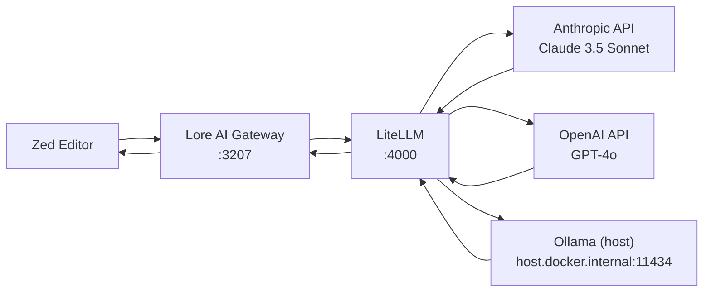

# perfect-ai-stack

**Docker-based AI proxy stack** — one command to run Lore AI Gateway + LiteLLM.

```
Zed → Lore (:3207) → LiteLLM (:4000) → Anthropic / OpenAI / Ollama (host)
```

## Prerequisites

- Docker + Docker Compose (v2)
- API keys in environment (see below)

## Quick start

```sh
git clone git@github.com:tulitheprogrammer/perfect-ai-stack.git
cd perfect-ai-stack

export ANTHROPIC_API_KEY=sk-ant-...
export OPENAI_API_KEY=sk-...

bin/ai-stack start
```

## Commands

| Command              | What it does                        |
|----------------------|-------------------------------------|
| `ai-stack start`     | Start all containers (detached)     |
| `ai-stack stop`      | Stop all containers                 |
| `ai-stack logs`      | Follow combined logs                |
| `ai-stack ps`        | Show container status               |
| `ai-stack update`    | Pull latest images and recreate     |
| `ai-stack setup-lat` | Scaffold lat.md in current project  |

## Environment Variables

All vars have sensible defaults — only `ANTHROPIC_API_KEY` and `OPENAI_API_KEY` are required.

### LiteLLM

| Variable             | Purpose                  | Default             |
|----------------------|--------------------------|---------------------|
| `ANTHROPIC_API_KEY`  | Claude 3.5 Sonnet        | **required**        |
| `OPENAI_API_KEY`     | GPT-4o                   | **required**        |
| `LITELLM_MASTER_KEY` | LiteLLM admin key        | `sk-litellm-master` |

### Lore AI Gateway

| Variable             | Purpose                  | Default               |
|----------------------|--------------------------|-----------------------|
| `LORE_LLM_KEY`       | Key Lore uses for LLM    | falls back to `OPENAI_API_KEY` |
| `LORE_CHAT_MODEL`    | Model for chat sessions  | `claude-3-5-sonnet`   |
| `LORE_WORKER_MODEL`  | Model for background workers (insights, compression, recall indexing) | `local-llama` |
| `LORE_DEBUG`         | Enable debug logging     | `true`                |

Override any of them inline:

```sh
LORE_CHAT_MODEL=gpt-4o LORE_WORKER_MODEL=claude-3-5-sonnet bin/ai-stack start
```

## Models

| Model name          | Backend         | Used by                          |
|---------------------|-----------------|----------------------------------|
| `claude-3-5-sonnet` | Anthropic API   | Chat sessions (Lore)             |
| `gpt-4o`            | OpenAI API      | Chat sessions (Lore)             |
| `local-llama`       | Ollama (host)   | Background workers (Lore)        |

Models are configured in [`config/litellm.yaml`](config/litellm.yaml). Add or remove models there.

## Architecture



## lat.md Scaffold

```sh
cd your-project
ai-stack setup-lat
```

## Legacy

The old shell-based approach (Lore + Headroom + LiteLLM as local CLIs) is archived in [`legacy/`](legacy/).
