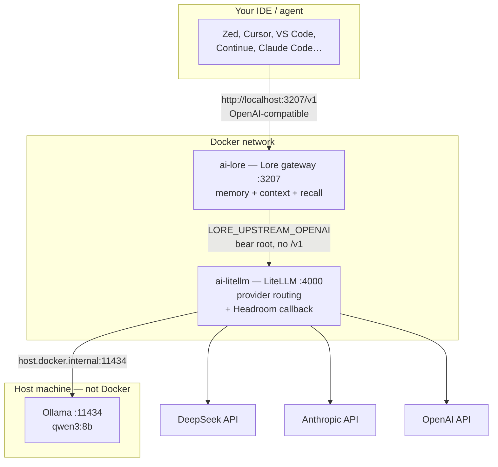
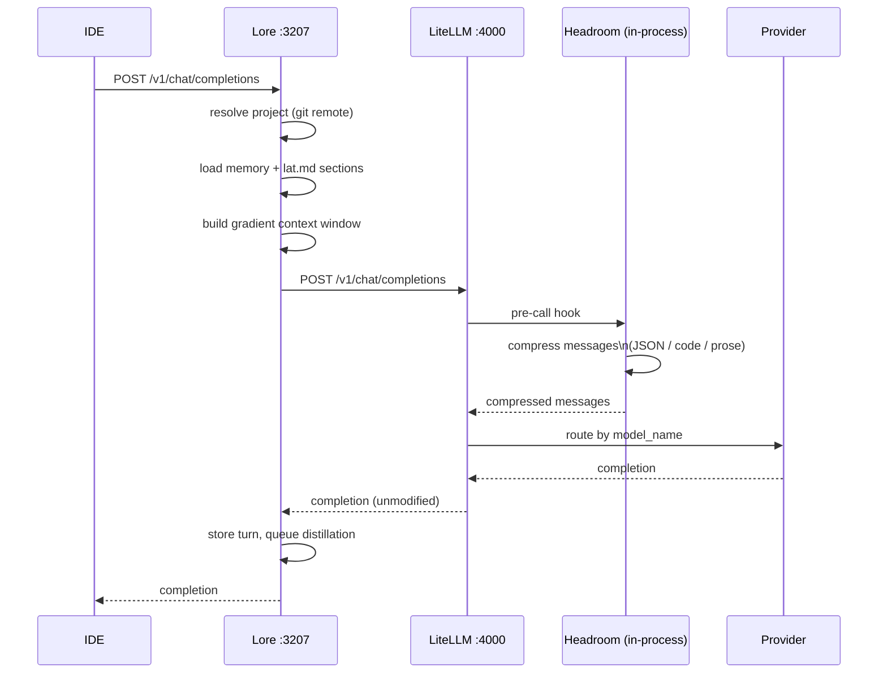
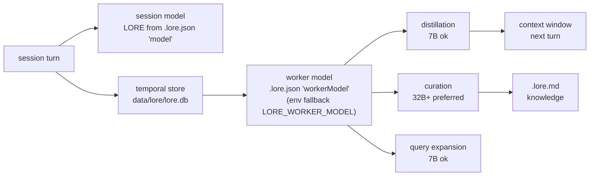
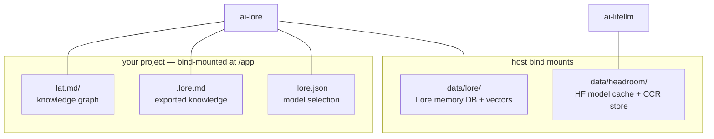

# perfect-ai-stack

**AI proxy stack**
LiteLLM (with Headroom compression sidecar)

- Lore in Docker,
- per-repo lat.md knowledge graph scaffolded git-hook enforcement.

```
// e.g using Zed IDE
Zed -> Lore (:3207) -> LiteLLM + Headroom (:4000) -> DeepSeek / Anthropic / OpenAI / Ollama (host)
```

## Install

One command, from your project:

```sh
cd ~/code/your-project
npx perfect-ai-stack init
```

`init` starts the gateway, scaffolds `lat.md/` + the pre-commit hook, and
prints the IDE config to use. Safe to re-run;
if the gateway is already up it, skips startup instead of restarting it.
Requires Docker Desktop (see [Prerequisites](#prerequisites)).

`npx` installs the package into npm's cache and runs `bin/ai-stack.sh` from
there.
Project files (`.lore.json`, `lat.md/`, git hooks) always land in the project
you run it from. The one exception is `.env`, which Compose only reads from the
stack directory — see [Where to put API keys](#where-to-put-api-keys).

`init` does **not** write a `.env`, and it never prompts — keys are read from
your shell environment (Docker Compose interpolates them directly). Exporting
them in your profile is the normal setup and needs no file at all; run
`npx perfect-ai-stack wizard` if you want one anyway (see
[Troubleshooting](#troubleshooting) if a key isn't being picked up).

Keep the memory DB and Headroom cache out of the npx cache dir, so they survive upgrades:

```sh
export AI_STACK_DATA_DIR=~/.ai-stack      # Lore DB + Headroom cache (shared across projects)
```

Working on the stack itself? Clone it and see
[Development](#development) — `sh bin/ai-stack.sh init` behaves identically.

## Prerequisites

**Docker Desktop, installed and running.**
That's the only requirement — no API keys needed to try it (local models run through Ollama).

```sh
open -a Docker      # macOS; wait for the whale icon to stop animating
```

`init` checks this and tells you exactly what's missing if it isn't there.

## Quick start

Three steps, in order. Do them all before touching your IDE.

### 1. Start the gateway

From any existing project:

```sh
npx perfect-ai-stack init
```

This starts the gateway, asks for your session + worker models (press Enter for
the defaults), scaffolds `lat.md/` + the pre-commit hook in your project, and
prints the config you'll need in step 3. First run pulls the LiteLLM image and
builds both containers — allow a few minutes. The first model request also
downloads Headroom's compression model (~275 MB), cached once in
`data/headroom/`.

### 2. Pull a local model

The default model is `qwen3:8b`, served by **Ollama on your host** — not inside
Docker. If Ollama isn't running, or the model isn't pulled, requests fail with
`Invalid model name passed in model=qwen3:8b` even though the gateway is
healthy. So:

```sh
brew install ollama && brew services start ollama   # or: ollama serve
ollama pull qwen3:8b
```

Prefer a cloud model instead? Put `DEEPSEEK_API_KEY` in your environment and use
`deepseek-flash` as the model name. You still need Ollama only if you want a
local worker (recommended — see [Model selection](#model-selection)).

Verify both halves before continuing:

```sh
curl -s http://localhost:11434/api/tags   # Ollama up, and qwen3:8b listed
curl -s http://localhost:3207/v1/models   # gateway up, models listed
```

### 3. Point your IDE at it

```
Base URL:  http://localhost:3207/v1
API key:   any non-empty string (auth is off on this local stack)
Model:     qwen3:8b            (free, local via Ollama)
           deepseek-flash   (needs DEEPSEEK_API_KEY)
```

No IDE config to write: the same endpoint works for Zed, Cursor, VS Code
(Continue), and anything else that takes a custom base URL. Send one message to
confirm, then check the log for `POST /v1/chat/completions ... 200`:

```sh
cd /path/to/perfect-ai-stack && docker compose logs litellm --tail 5
```

> **Heads up on the default worker, `qwen3:8b`.** It is a _thinking_ model, which
> through LiteLLM is a trap: Ollama reports the reasoning trace on a channel
> LiteLLM drops, so a reply that spends its budget thinking arrives as `200 OK`
> with **empty content**. Background distillation then fails silently
> (`worker empty response` / `lore-distill failed (no-response)`). The stack
> therefore pins `think: false` on it in `config/litellm.yaml`, so it answers
> directly and this cannot happen. A thinking model you add yourself needs the
> same treatment — for the **worker**, raising `max_tokens` does not help, since
> Lore sets the worker's limit itself.

That's it — you're running. Optional next steps: [choose your models](#model-selection),
wire up the [knowledge graph over MCP](#knowledge-graph-access-mcp), or read
[Architecture](#architecture) to see what just happened.

**Already using a tool with built-in memory or context compression?** Read
[Choosing what to use](#choosing-what-to-use) before pointing it here — for
Claude Code and Copilot you likely want only part of this stack.

> **Ran Lore on the host before?** Clear the stale env vars first — they
> override the compose defaults and point inside the container at nothing.
>
> ```sh
> unset LORE_UPSTREAM_OPENAI LORE_UPSTREAM_ANTHROPIC LORE_WORKER_UPSTREAM LORE_WORKER_MODEL LORE_WORKER_API_KEY
> ```

## Choosing what to use

Some clients already ship memory and context compression. Pointing this stack
at them can duplicate work or fight the built-in behaviour, so pick per tool:

| Your client                              | Already has                                            | Use from this stack     | Why                                                                                                             |
| ---------------------------------------- | ------------------------------------------------------ | ----------------------- | --------------------------------------------------------------------------------------------------------------- |
| **Claude Code**                          | Auto-compaction, `CLAUDE.md` memory                    | ✅ `lat.md` + hook only | Skip Lore — it's also an Anthropic-protocol proxy and its distillation overlaps compaction                      |
| **GitHub Copilot** (VS Code / JetBrains) | Repo-aware indexing; **BYOK base URL is very limited** | ⚠️ `lat.md` + hook only | Copilot generally can't take a custom `OPENAI_BASE_URL`; point Continue at the gateway instead if you want Lore |
| **Cursor**                               | Built-in codebase index + rules                        | ✅ Full stack           | Its index is code-retrieval, not decision/error memory — no overlap with Lore                                   |
| **Zed**                                  | Nothing built-in                                       | ✅ Full stack           | The reference client                                                                                            |
| **Continue / Cline / Aider**             | Nothing built-in                                       | ✅ Full stack           | Plain BYOK OpenAI clients                                                                                       |
| **OpenCode / Pi**                        | Nothing built-in                                       | ✅ Full stack           | `lore run` auto-configures these natively                                                                       |

Rule of thumb: **`lat.md` never conflicts** — it's a plain markdown knowledge
graph, and Lore indexes it automatically when present. The parts worth being
selective about are **Lore** (memory) and **Headroom** (token compression),
both of which overlap what Claude Code and Copilot already do natively.

### Add only the knowledge graph (no Docker)

If you want the `lat.md` workflow without the gateway:

```sh
npm i -g lat.md
cd your-project && lat init          # creates lat.md/, wires agents
lat check                            # also runs on commit once init adds the hook
```

### Use the gateway with a tool that has its own memory

Point the tool at `http://localhost:3207/v1` as usual, then disable the
overlapping halves in `.lore.json` at your project root:

```json
{
  // Keep context management + recall, drop the long-term knowledge base
  "knowledge": { "enabled": false }
}
```

Set `"knowledge": { "enabled": false }` when your tool manages its own
persistent facts; Lore then still handles distillation, recall, and the
context window, without maintaining a second set of facts. See Lore's own
configuration docs for the full schema.

## Commands

| Command                              | What it does                                                                                       |
| ------------------------------------ | -------------------------------------------------------------------------------------------------- |
| `npx perfect-ai-stack <cmd>`         | Same as `sh bin/ai-stack.sh <cmd>` — run from any project                                          |
| `sh bin/ai-stack.sh init`            | **Start here.** Start gateway + scaffold this project + show IDE config                            |
| `sh bin/ai-stack.sh wizard`          | Prompt for API keys; writes `.env` to the **stack dir** (optional — shell exports work without it) |
| `sh bin/ai-stack.sh start`           | Start the gateway only; also scaffolds lat.md + hook                                               |
| `sh bin/ai-stack.sh stop`            | Stop the gateway                                                                                   |
| `sh bin/ai-stack.sh logs`            | Follow logs (all services)                                                                         |
| `sh bin/ai-stack.sh ps`              | Show status                                                                                        |
| `sh bin/ai-stack.sh update`          | Rebuild LiteLLM (with Headroom) + Lore from latest base images                                     |
| `sh bin/ai-stack.sh setup-lat [dir]` | Scaffold lat.md + hook in `[dir]` (default: cwd); runs on `start` too                              |

## Model selection

You choose which models your session and Lore's background workers use.
Selection is **per project**, stored in `.lore.json` at your project root, so
switching models needs no restart and doesn't affect other projects.

```sh
npx perfect-ai-stack models                              # show current + change
npx perfect-ai-stack models qwen3:8b ministral-3:8b   # session, then worker
```

That writes `.lore.json`:

```json
{
  "model": { "providerID": "openai", "modelID": "qwen3:8b" },
  "workerModel": { "providerID": "openai", "modelID": "ministral-3:8b" }
}
```

With no selection stored yet, a bare `models` writes the defaults (`qwen3:8b` for
both) before printing them, so what it reports as the current selection is always
what `.lore.json` actually contains. An **existing** selection is never
overwritten by that — only `models <session> [worker]`, `--reset`, or the
interactive menu change it. `--reset` restores the default pair.

- **session** — the model your IDE chat uses.
- **worker** — distillation, curation, query expansion (background, async).
- **curator** — **off by default.** Curation writes durable entries into
  `.lore.md`, which is committed and PR-reviewed; opting in means you or a
  reviewer vet what the agent recorded. Turn it on with:

  ```json
  { "curator": { "enabled": true } }
  ```

  Opt in when you want automatic extraction of decisions and preferences that
  `lat.md` cannot hold (it describes code structure; the curator captures
  session facts). It needs a capable model — see the measured table below.

- Omitting `workerModel` falls back to the session model, then to
  `LORE_WORKER_MODEL` (env default `openai/qwen3:8b`).
- Existing keys in `.lore.json` (e.g. `knowledge`) are preserved, and an
  explicit `curator` setting is never overwritten by a re-run.
- Both `providerID`s are `openai` because every model here is reached through
  LiteLLM over the OpenAI protocol. **Don't split providers** — cross-provider
  worker calls fail (wrong credentials, wrong API format).

### Changing models later

Per project, stored in `.lore.json`, and effective immediately — no gateway
restart, no effect on your other projects:

```sh
npx perfect-ai-stack models                           # show current + change
npx perfect-ai-stack models qwen3:8b ministral-3:8b   # session + worker
npx perfect-ai-stack models --curator on              # opt in to curation
npx perfect-ai-stack models --curator off             # opt out (default)
npx perfect-ai-stack models --reset                   # back to the defaults
npx perfect-ai-stack models --help
```

Bare `models` prints the effective selection and **warns if a chosen model is
not usable** — otherwise that only surfaces later as a confusing
`Invalid model name` at request time.

Interactive runs use an **arrow-key menu** (up/down to move, Enter to select,
`q` to cancel) instead of typing a name, so a typo cannot happen:

```
  Worker model :
  > qwen3:8b                 local
    ministral-3:8b           local
  up/down move   Enter select   q cancel
```

The **worker menu lists local models only.** Choosing a remote worker is what
meters the stack, and hiding those entries turns an easy mistake into an
impossible one — remote workers remain available via `--yes` for the case where
a local model genuinely cannot curate. Piped input and non-TTY shells fall back
to typed entry automatically, so scripted use is unchanged.

**Only usable models are offered.** The list is the intersection of what the
gateway serves (so LiteLLM knows its provider, key and pricing) and what is
actually reachable now — a local model that is configured but not pulled is
filtered out, because choosing it fails at request time. Each entry is labelled
`local` or `remote`, which matters for the worker: remote models bill on every
session. Passing an unusable name to `models <session> [worker]` is rejected with
the available list rather than written.

```
  Available models (served by the gateway AND usable now):
    deepseek-flash        remote
    deepseek-v4-pro          remote
    qwen3:8b                 local
    ministral-3:8b           local
```

On an interactive terminal that table is drawn **once**, by the selection menu
itself (`up/down move, Enter select, q cancel`). The printed block above appears
only where no menu can run — a pipe, a redirect, or a non-interactive shell — so
the list is never duplicated and never silently missing.

**`local` vs `remote` is the label that costs money.** Local means Ollama on
this machine (free per call); remote means a cloud provider that bills per
token. Choosing a **remote model as the worker is confirmed before writing**,
because the worker runs on every session — distillation, curation and query
expansion — whether or not you chat, so a remote worker meters continuously:

```
  ⚠ 'deepseek-flash' is a REMOTE model and you have chosen it as the WORKER.

    The worker runs on EVERY session ... A remote worker bills continuously,
    so this turns a free local stack into a metered one.

  Use a remote worker anyway? [y/N]:
```

Declining leaves `.lore.json` untouched. In a non-interactive shell the write is
**refused** rather than silently accepted, so a script cannot meter you by
accident; pass `--yes` before the models to opt in deliberately
(`ai-stack models --yes <session> <remote-worker>`). A remote worker is also
flagged in the current-selection output afterwards, since it is otherwise
indistinguishable from a free one.

Remote _is_ the right call when your local model cannot curate well — a cheap
cloud worker beats a small local one, and Lore's curation floor is 32B+.

`thinking` is a **hint, not a filter**, and it appears only for models the
stack does not configure (anything you add yourself that reasons by default).
The one local model whose name suggests reasoning, `qwen3:8b`, is pinned to
`think: false` in `config/litellm.yaml` — thinking made it return empty content
through LiteLLM — so it is not labelled. The label is derived from the model
name (no capability flag exists in `/v1/models` or Ollama's tags), so treat it
as a rough hint either way.

**Session and worker must share one API protocol.** Workers call with the
session's transport, so a mixed pair (e.g. an Anthropic session with an
OpenAI worker) fails at runtime with wrong credentials / wrong API format —
invisibly, since it only breaks background distillation. The CLI derives each
model's protocol and refuses a mismatch before writing anything:

```
  Refusing: session (claude-3-5-sonnet -> anthropic) and worker (qwen3:8b -> openai) use different
  APIs. Lore's workers must match the session's protocol — a mixed pair
  fails at runtime with wrong credentials / wrong API format.
```

Every model this stack ships is OpenAI-protocol through LiteLLM, so the
constraint is satisfied by default — it only bites if you add an Anthropic
entry to `config/litellm.yaml` and pair it with a local worker.

Everything lands in `.lore.json` at your project root:

```json
{
  "model": { "providerID": "openai", "modelID": "qwen3:8b" },
  "workerModel": { "providerID": "openai", "modelID": "qwen3:8b" },
  "curator": { "enabled": false }
}
```

It is meant to be committed, so the whole team gets the same models. Hand-editing
is fine too — the CLI merges rather than overwrites, and preserves keys it does
not own (like `knowledge`).

**Adding a brand-new model** is the one change that needs a restart, because
LiteLLM must know the provider, key, and pricing before the name means anything:

1. append a `model_list` entry in `config/litellm.yaml`
2. `npx perfect-ai-stack restart`
3. `npx perfect-ai-stack models <new-model> ...`

A ready-made local block (`qwen2.5-coder:14b`) is already present, commented.
Step 2 is what makes the name appear in `/v1/models`; skipping it is the
common cause of "model not found" after editing the config.

### Onboarding picks these for you

`init` asks for the session and worker model as part of setup, so a new
project starts on the measured-best local pair with the curator off. Press
Enter to accept the defaults, or name any model the gateway serves. Running
non-interactively (npx in a script, CI) skips the prompt and writes the
defaults rather than hanging.

### Make the worker a local model

The worker runs on **every session**, in the background, whether or not you
actually chat — distillation after each segment, curation on idle, query
expansion per recall. Point it at a cloud model and you pay on every session.
Point it at Ollama and that cost is zero.

**Thinking models must not be the worker, unless you disable thinking.** `qwen3:8b`
emits reasoning before content; Ollama reports that on a separate channel and
LiteLLM drops it, so a call that spends its budget thinking returns `200 OK`
with **empty content** and the worker logs `no-response`. That is a
**correctness** problem, not just token cost: distillation silently stops
writing anything. `config/litellm.yaml` pins `think: false` on the shipped
`qwen3:8b` entry, so the default is safe. A thinking model you add yourself
needs the same treatment — `/no_think` is not a fix, since the worker builds
its own prompts.

### Which local model to use (measured)

Lore's docs put the curation floor at 32B+. We tested the 8B candidates on the
real task anyway — specs alone don't predict this, and the result was not what
parameter counts suggest:

```sh
ollama pull qwen3:8b
npx perfect-ai-stack models qwen3:8b qwen3:8b     # session + worker
```

| Model            | Categories correct | Duplicates | Verdict          |
| ---------------- | ------------------ | ---------- | ---------------- |
| `qwen3:8b`       | **4/4**            | 0          | ✅ use this      |
| `ministral-3:8b` | 2/4                | 0          | ❌ misclassifies |

`ministral-3:8b` systematically labelled "switching from npm to pnpm" a
**gotcha** instead of a decision/preference, and dropped the `preference`
category entirely — identically across three runs, so it is a real flaw rather
than sampling noise. A wrong category in a committed `.lore.md` is exactly the
review burden Lore warns about.

`qwen3:8b` classified all four facts correctly and kept the reason ("duplicate
lockfiles") in the content. Its `think: false` setting is why it is usable as
the worker at all: with thinking on, the reasoning trace consumed the response
and the caller got empty content.

The scores above were judged by hand. Re-scored mechanically (does each fact
appear, and with a defensible category?) the `think: false` setting costs one
label: the auth/billing rule comes back as `pattern` rather than
`architecture`. Every entry is still captured, valid JSON, no duplicates — and
that is a far smaller cost than distillation silently stopping.

### Compare models yourself

Quality is not predictable from parameter count, so measure it before choosing.
This sends one fixed conversation (5 known durable facts) to each model through
the gateway and prints the raw output plus a format check:

```sh
sh scripts/eval-worker.sh                 # every local model the gateway serves
sh scripts/eval-worker.sh qwen3:8b         # or specific models
```

Read-only — it does not write `.lore.md` or touch the database. What to look
for: valid JSON, correct categories, no duplicate titles, and no invented
facts. A wrong category is the failure to watch for most closely: it is the one
that silently corrupts a committed file while looking perfectly well-formed.

This is the recommended shape: **remote model for the session, local model for
the worker**. It works because both route through LiteLLM on the same protocol —
see [All models route through LiteLLM](#all-models-route-through-litellm).

A real run's output (model `qwen3:8b`, reformatted from one line):

```json
[
  {
    "category": "decision",
    "title": "Package Manager Switch",
    "content": "Switching from npm to pnpm across all repos due to duplicate lockfiles"
  },
  {
    "category": "architecture",
    "title": "Database Access Pattern",
    "content": "Auth service must communicate with billing DB only through API gateway"
  },
  {
    "category": "preference",
    "title": "Python Linting Tool",
    "content": "Use ruff instead of flake8 for Python linting"
  },
  {
    "category": "gotcha",
    "title": "Webhook Timeout Handling",
    "content": "Payments webhook times out without setting Retry-After header on 429 responses"
  }
]
```

```
    valid JSON: yes
    entries:    4
    categories: architecture, decision, gotcha, preference
    dup titles: 0
```

4 of 5 facts, correct categories, no duplicates. That is better than the 8B
small-model reputation suggests — but it still missed the subtlest entry (the
causal link between the migration incident and the DB rule), which is exactly
the kind of thing `lat.md` holds better anyway.

**Local quality floors** ([Lore's local-inference guide](https://withlore.ai/docs/guides/local-inference/)):

| Pipeline            | Local model        | Notes                                                                      |
| ------------------- | ------------------ | -------------------------------------------------------------------------- |
| **Distillation**    | 7B-class, Q4/Q5    | Fine. Produces usable observation logs, even code-heavy                    |
| **Query expansion** | 7B-class           | Fine — it only rephrases recall queries                                    |
| **Curation**        | **32B+ preferred** | 7B yields duplicates, wrong categories, low-confidence facts in `.lore.md` |

**When to opt in to curation.** These floors are why it ships off:

| Your worker model                  | Curation                                                       |
| ---------------------------------- | -------------------------------------------------------------- |
| 8B-class local (default)           | ❌ Leave it off — under the floor; one tested 8B misclassified |
| 32B+ local, or a cheap cloud model | ✅ Opt in — clears the documented floor                        |

With curation off you keep distillation, recall, gradient context management,
and `lat.md` indexing; you lose automatic `.lore.md` extraction. That is the
intended default for an 8B local worker, not a degraded mode.

If you have the RAM for 32B, or want to point the worker at a cheap cloud model
for curation only, opt in and check the output with
`sh scripts/eval-worker.sh`.

**To use a model not listed above**, add it to `config/litellm.yaml` under
`model_list`, then restart the gateway once (`ai-stack restart` — or
`docker compose up -d --force-recreate litellm` if you're calling compose
directly; a plain `up -d` can leave the old container running and the new
model invisible in `/v1/models`). Example:

```yaml
- model_name: qwen2.5-coder:14b
  litellm_params:
    model: ollama/qwen2.5-coder:14b
    api_base: http://host.docker.internal:11434
```

Then `ai-stack models qwen3:8b ministral-3:8b`. Any model your IDE
list shows comes from this file — `curl -s http://localhost:3207/v1/models`,
which is the authoritative check that a new entry registered.
Both local blocks are already in `config/litellm.yaml`: `qwen3:8b` (the
default) and `ministral-3:8b` are active; `llama3.1:8b` and `qwen2.5-coder:14b`
are commented out. Uncomment the one you pulled.

### Don't point Lore directly at Ollama

Lore's [local-inference guide](https://withlore.ai/docs/guides/local-inference/)
shows `LORE_UPSTREAM_OLLAMA=http://localhost:11434` for talking to a local
server without a proxy. **That env var does not exist in the gateway version
pinned here** (`@loreai/gateway` 0.40.0 reads only `LORE_UPSTREAM_OPENAI` and
`LORE_UPSTREAM_ANTHROPIC`), so setting it is a silent no-op.

Even on a newer gateway, prefer routing through LiteLLM: `LORE_UPSTREAM_*` is
where Lore forwards the session, so bypassing LiteLLM also bypasses
**Headroom compression**, and you'd lose the provider routing that
`config/litellm.yaml` centralises. Local models here are local _because
LiteLLM's `api_base` points at your Ollama host_ — not because Lore knows
Ollama exists.

## One stack, many projects

The stack is cloned **once** — every project you work in uses the same
running gateway, and `lat` is a single global npm install. Per-project setup is
the lat.md scaffold + pre-commit hook plus this project's own model choice:

```sh
cd ~/code/project-a
sh /path/to/perfect-ai-stack/bin/ai-stack.sh init     # scaffold + choose session model
# or from anywhere: sh .../ai-stack.sh setup-lat ~/code/project-b
```

Run it once per project — nothing to clone or reinstall. `start`/`stop`/
`logs`/`update` stay in the stack clone; point each project's IDE at the
shared gateway (see “IDE / agent setup”).

### What is shared and what is per-project

Lore resolves the **worker** model in this order (see
`packages/gateway/src/worker-model.ts`):

| Priority | Source                                               | Scope                    |
| -------- | ---------------------------------------------------- | ------------------------ |
| 1        | `LORE_WORKER_MODEL` env                              | **all projects**         |
| 2        | `.lore.json` → `workerModel`                         | the mounted project only |
| 3        | cost-aware default (cheaper same-family model)       | per session              |
| 4        | `.lore.json` → `model`, else the session's own model | per project              |
| 5        | the provider's built-in default                      | —                        |

`ai-stack models <session> <worker>` therefore writes the worker to the stack
`.env` **as well as** the project's `.lore.json`:

- the **`.env` entry is what takes effect** — priority 1 is returned before the
  config file is even read, so it applies to every project on the machine;
- the `.lore.json` entry is kept so the project stays self-describing (and so a
  clone of it behaves correctly on its own).

The **session** model is genuinely per-project and lives only in `.lore.json`.
Because one container mounts one directory at `/app` (see below), a second
project's `.lore.json` session model only applies when the gateway is started
against that project:

```sh
cd ~/code/project-b && ai-stack stop && ai-stack init
```

`init` says so explicitly when the running gateway is mounted elsewhere, rather
than skipping in silence.

### Why the worker is global

One container has one `/app` bind mount, so a per-project `.lore.json`
cannot be visible to every project at once — Lore's config loader reads
exactly `join(projectDir, ".lore.json")` with no search path. Any setting that
must hold across projects has to travel by environment variable. The worker
model is the setting where this matters most: it runs on **every** session
(whether or not you chat), so a wrong value bills continuously.

The worker also has no reason to differ per project — unlike the session model,
which is what you type into your editor.

### The project mount

`init` sets `AI_STACK_PROJECT_DIR`, and Compose mounts it twice:

| Mount                 | Purpose                                                  |
| --------------------- | -------------------------------------------------------- |
| `<project>:/app`      | Lore's project root — `.lore.json`, `.lore.md`, `.lore/` |
| `<project>:<project>` | the same directory at its **real absolute path**         |

The second mount is what lets a request that names its project (the
`X-Lore-Project` header, or `lore run`) resolve to a directory that exists
inside the container. Without it only `/app` resolves, and every project gets
attributed to whichever one was mounted at startup.

If `AI_STACK_PROJECT_DIR` is unset, it defaults to the stack directory — so a
gateway started by bare `ai-stack start` (not `init`) mounts the stack repo
itself, and no project's `.lore.json` is read. Set it explicitly, or use `init`.

## Environment Variables

All vars have sensible defaults — API keys are only needed if you use cloud models.
Docker Compose interpolates `${VAR}` only inside `docker-compose.yml`, not
within `.env` values — overrides must be literal values (no `$REF`
indirection; see `.env.example.md`).

### Where to put API keys

**The shell is the default and needs no file.** Export them in your shell
profile (`~/.zshrc`, `~/.bashrc`) and Compose picks them up when you start the
stack:

```sh
export DEEPSEEK_API_KEY="sk-..."
export ANTHROPIC_API_KEY="sk-ant-..."
```

(`DEEPSEEK_API_KEY` is the canonical name; the older `OPENAI_API_KEY` still
works and is used as a fallback if `DEEPSEEK_API_KEY` is unset. Setting both is
fine — `DEEPSEEK_API_KEY` wins.)

Alternatively, write them to a `.env` file (gitignored). Note where it has to
go: **Compose only auto-loads `.env` from the stack directory**, not from the
project you run `init` in. A template with every supported variable (zero
secrets) is committed as [`.env.example.md`](.env.example.md) — copy it to
`.env` in the stack dir and adjust. The wizard (`ai-stack wizard`) also writes
one for you:

```sh
DEEPSEEK_API_KEY=sk-...
ANTHROPIC_API_KEY=sk-ant-...
```

The wizard always shows its menu, even when every key is already exported —
but a key it finds in your environment is never copied into the file, so running
it can't create a duplicate you then have to keep in sync. Choose `4` to get out
without writing anything.

Use `.env` when you want values that differ per stack checkout, or keys you
don't want in your shell profile. Don't override the `LORE_*` variables unless
you need to — the defaults (shown in `.env.example.md`) point Lore at LiteLLM,
and that's where you want it. Overriding them while the containers are running is
the classic "my changes did nothing" trap; see
[Troubleshooting](#troubleshooting).

### LiteLLM

| Variable            | Purpose                | Default                               |
| ------------------- | ---------------------- | ------------------------------------- |
| `ANTHROPIC_API_KEY` | Claude 3.5 Sonnet      | only if using Claude                  |
| `DEEPSEEK_API_KEY`  | DeepSeek (canonical)   | only if using cloud                   |
| `OPENAI_API_KEY`    | Legacy alias for above | falls back to/from `DEEPSEEK_API_KEY` |

`docker-compose.yml` sets both names, each falling back to the other, so
exporting either one works — `DEEPSEEK_API_KEY` wins when both are set.

No `LITELLM_MASTER_KEY` is set: LiteLLM runs **auth-disabled** (accepts any
key) so Lore's forwarded client keys work without a key database. This is a
local single-user stack; don't expose port `4000` beyond your machine.

### Lore (Docker)

| Variable                  | Purpose                         | Default                         |
| ------------------------- | ------------------------------- | ------------------------------- |
| `LORE_UPSTREAM_OPENAI`    | OpenAI-compatible upstream      | `http://litellm:4000`           |
| `LORE_UPSTREAM_ANTHROPIC` | Anthropic upstream              | `http://litellm:4000`           |
| `LORE_WORKER_UPSTREAM`    | Upstream for background workers | `http://litellm:4000`           |
| `LORE_WORKER_MODEL`       | Background worker model         | `openai/qwen3:8b`               |
| `LORE_WORKER_API_KEY`     | Key used for worker calls       | `sk-litellm-master` (any works) |
| `LORE_DEBUG`              | Enable debug logging            | `true`                          |

`LORE_WORKER_MODEL` is a `provider/model` pair. The part after the slash is the
model name sent to `LORE_WORKER_UPSTREAM` and **must exist in LiteLLM's
`model_list`** (`config/litellm.yaml`). The part before the slash is the
**provider ID**, which selects the protocol the worker speaks:

- `openai/…` — OpenAI-compatible chat completions (LiteLLM, DeepSeek, Ollama).
- `anthropic/…` — Anthropic Messages API.

It is the **highest-priority** source for the worker model — returned before the
config file is read — so it applies to every project regardless of which one the
container is mounted to. `ai-stack models` writes it to the stack `.env` for you;
prefer that over editing `.lore.json` by hand. Set it here (not per project) if
you want one shared worker across all your projects, which is the supported setup
for a shared gateway. See
[One stack, many projects](#one-stack-many-projects) for the full precedence.

Lore resolves `providerID` and derives the protocol from it — it does not parse
a prefix string, and there is no implicit `anthropic` fallback for a bare model
name. Always write the `openai` provider when the worker targets LiteLLM, or the
worker speaks a protocol LiteLLM's `/v1/chat/completions` route won't answer.

**Workers must use the same provider as the session** — cross-provider worker
calls fail (wrong credentials, wrong API format). They _may_ use a different
model and a different real backend: `deepseek-flash` (DeepSeek) for the
session and `qwen3:8b` (Ollama) for the worker is fine, because both are
`openai` provider and both route through LiteLLM. Override the URL the worker
calls with `LORE_WORKER_UPSTREAM`.

Change both the provider and the model name if your Ollama uses a different tag
(e.g. `openai/qwen2.5:7b` + a matching `model_list` entry).

The upstream defaults point at LiteLLM inside the Docker network — override
them only if you want Lore to skip LiteLLM.

### Ollama-only (no API keys)

No keys are needed for a fully local setup — Ollama runs on your host and
LiteLLM reaches it at `host.docker.internal:11434`. Setup is
[Quick start step 2](#2-pull-a-local-model); use `qwen3:8b` as both the session
and worker model.

## Optional Models

| Model name        | Backend       | Notes                                     | Role    |
| ----------------- | ------------- | ----------------------------------------- | ------- |
| `deepseek-flash`  | DeepSeek API  | needs `DEEPSEEK_API_KEY`                  | session |
| `deepseek-v4-pro` | DeepSeek API  | needs `DEEPSEEK_API_KEY`/`OPENAI_API_KEY` | session |
| `ministral-3:8b`  | Ollama (host) | measured: misclassifies                   | worker  |
| `qwen3:8b`        | Ollama (host) | **worker + session** — measured best      | worker  |
| `llama3.1:8b`     | Ollama (host) | untested alternative, 128K                | worker  |

## Architecture

### Request flow

One box means one network hop. Everything above the "Docker network" line runs
in a container; Ollama runs **on the host**, which is why LiteLLM reaches it at
`host.docker.internal` rather than a service name.



Lore is the OpenAI-compatible `/v1` endpoint your IDE talks to. It is the only
port you point a client at; `:4000` is LiteLLM's own API and is not part of the
user-facing path.

### What happens on one request



Two things worth noting in that flow: Headroom compresses the **request only**
(responses pass through untouched), and the memory write happens on the way
back so a slow distillation never blocks your reply.

### Session vs worker

This is the part that most affects cost. The **worker** runs three background
pipelines — distillation, curation, query expansion — on every session,
whether or not you chat.



Both models must be the **same provider** (here: `openai` via LiteLLM) —
cross-provider worker calls fail. Point the worker at a local model to keep
this at zero cost; see [Make the worker a local model](#make-the-worker-a-local-model).

### Where state lives

Everything stateful is on the host, so it survives `stop`, `update`, and
`docker compose down`.



The container itself is disposable: `lat.md/`, `.lore.md`, and `.lore.json`
are meant to be committed, while `data/` holds the machine-local DB and is
gitignored.

## IDE / agent setup (BYOK)

The stack is client-agnostic: any editor or coding agent that supports
bring-your-own-key (BYOK) OpenAI-compatible endpoints can use it. Point your
client at Lore's gateway — any API key value works, since LiteLLM runs
auth-disabled and the key is just passed through:

```sh
export OPENAI_BASE_URL=http://localhost:3207/v1      # OpenAI-compatible clients
# or
# export ANTHROPIC_BASE_URL=http://localhost:3207     # Anthropic-protocol clients
```

Use a model name from the Models table above (e.g. `deepseek-flash` for
DeepSeek, or `qwen3:8b` for Ollama). Zed, Cursor, VS Code
Copilot, Claude Code — anything that accepts a custom base URL — works the
same way. These are guidelines, not repo-committed IDE config: adapt to
whatever editor your team uses.

### Knowledge graph access (MCP)

If your IDE supports MCP, register lat's server so the agent queries the graph
with `lat search` / `lat section` instead of grepping. Example — Zed
(`.zed/mcp.json` in the project):

```json
{
  "servers": {
    "lat": { "command": "lat", "args": ["mcp"] }
  }
}
```

Claude Code, Cursor, and friends get hooks + MCP automatically from
`lat init`. For other IDEs, adapt the pattern: `lat mcp` speaks stdio MCP.

Lore's own gateway also prints these instructions on startup
(`docker compose logs lore`).

## lat.md

[`lat.md`](https://www.npmjs.com/package/lat.md) is a markdown knowledge
graph for the codebase — high-level concepts, business logic, and architecture
that your agent reads via `lat search` / `lat section` (or its MCP server).
`ai-stack start` scaffolds it if missing or still just the committed
placeholder intro file; re-run with `sh bin/ai-stack.sh setup-lat`.

```sh
lat search "payment flow"   # semantic search across lat.md sections
lat section "architecture"  # show a section with its links and refs
lat gen agents.md           # generate agent instructions that use lat
lat check                   # validate links + code references (runs on every commit)
lat reindex                 # rebuild the embedding index (lat.md/.cache/, gitignored)
```

`lat init` (which the setup runs) is interactive — it asks which coding agents
you use and wires up hooks/MCP/skills for them. It still creates a valid
`lat.md/` when stdin is not a terminal, so an unattended `start` leaves the
project with a graph; re-run `lat init` interactively afterwards to pick
agents/hooks/MCP. Semantic search works offline out of the box (bundled local
embedding model) — no key needed.

**Enforcement:** two layers, installed by `setup-lat` (and by `init`/`start`).

1. **Git pre-commit hook** (`.git/hooks/pre-commit`) runs `lat check`. A commit
   that changes a `// @lat:` anchor without updating the graph fails — docs
   can't drift silently, for human edits as well as agent edits. The install is
   idempotent: an existing hook that already runs `lat check` is left alone, and
   one without it gets `lat check` appended.
2. **GitHub Actions workflow** (`.github/workflows/lat.yml`) runs the same
   `lat check` on every push and PR. The hook alone is not enough: it is local
   (never runs for a contributor who doesn't have it), bypassable with
   `--no-verify`, and does not run for pull requests from forks.

   The workflow installs the `lat` CLI rather than using
   `vercel-labs/lat.md@action-v1` from the upstream docs — **no `action-*` tag
   has been published yet**, so a workflow referencing one fails immediately on
   a missing ref. Once a release exists, switch to
   `uses: vercel-labs/lat.md@action-vX.Y.Z` and drop the Node/npm steps.

   It is only written when the target is a git repo with a **GitHub** remote,
   and never overwrites an existing workflow that already runs `lat check`.

The knowledge base itself (`lat.md/lat.md`) is meant to be committed; only the
generated embedding index (`lat.md/.cache/`, one SQLite file) is gitignored,
along with `lat.md/node_modules/`. The CLI's own config lives outside the repo
(`~/Library/Application Support/lat/config.json` on macOS,
`lat config` prints the path) and needs no ignore entry.

## Headroom

Headroom runs **inside the LiteLLM container** as a callback — no separate
service. The custom image (`litellm/Dockerfile`) installs `headroom-ai`, and
`litellm/entrypoint.py` registers `HeadroomCallback` as a LiteLLM callback
_before_ the proxy starts. (YAML dotted-path callbacks aren't used: LiteLLM
registers those as the class, not an instance, which silently breaks the async
pre-call hook.)

Before each request is forwarded to a provider, the callback compresses the
messages in-process (JSON tool outputs via SmartCrusher, code via tree-sitter,
prose via the Kompress-v2-base model). Responses pass through unchanged. This
applies to **both** Lore's session model and its background worker model — all
Lore traffic is routed through LiteLLM (see below).

- Local-first: nothing is sent to a Headroom cloud; compression runs on your
  machine in the LiteLLM container.
- User messages are left untouched by default, and code in the last 4
  messages is protected from compression (coding-agent defaults).
- **First compression downloads the model** (`chopratejas/kompress-v2-base` from
  HuggingFace, ~a few hundred MB) and can take a minute. It is cached in
  `data/headroom/` so later starts don't re-download it. On x86 hosts without
  AVX2 (some Docker/QEMU setups), Headroom falls back to non-ONNX compressors
  automatically.
- In callback mode compression is one-way (originals are not retrievable — CCR
  retrieval is a proxy-mode feature), but the CCR originals store still lives on
  the host (`data/headroom/ccr_store.db`), so a container recreate doesn't wipe
  it mid-session.

## Persistence

Everything stateful lives in `data/` on the host — outside the containers, so
it survives `stop`, `update`, and `docker compose down`:

| Dir              | What it holds                                   |
| ---------------- | ----------------------------------------------- |
| `data/lore/`     | Lore memory (SQLite DB + vector embeddings)     |
| `data/headroom/` | Headroom's HF model cache + CCR originals store |

```sh
sqlite3 data/lore/lore.db "SELECT * FROM projects;"
```

`.lore.md` exports land in this repo's root (the container's working directory).
Already have a Lore DB from a previous host install at `~/.local/share/lore`?
Copy it over once before the first start:

```sh
mkdir -p data/lore && cp -R ~/.local/share/lore/. data/lore/
```

### All models route through LiteLLM

Lore's gateway hardcodes a model-prefix → provider table (`claude-*` →
`api.anthropic.com`, `gpt-*`/`deepseek-*` → OpenAI, …) that would bypass
LiteLLM. The Lore Dockerfile (`Dockerfile`) patches that table out, so **every**
session request falls through to `LORE_UPSTREAM_*` (LiteLLM) and gets Headroom
compression. LiteLLM then maps the model name to the real provider via
`config/litellm.yaml`.

The **worker** takes a separate path: `LORE_WORKER_MODEL` splits on `/` into
`provider/model`, and the provider ID selects the protocol. Write the `openai`
provider explicitly. The default `openai/qwen3:8b` speaks the OpenAI
protocol, so the worker sends plain `qwen3:8b` to LiteLLM (→ Ollama), exactly
like the session model sends `deepseek-flash` (→ DeepSeek). Session and worker
can therefore use different real backends (DeepSeek + Ollama) as long as both use
the `openai` provider through LiteLLM — that same-provider constraint is why a
cross-provider worker pairing fails with wrong credentials / wrong API format.

Check it works:

```sh
docker compose logs litellm | grep Headroom   # per-request "Headroom: N->M tokens" lines
```

## Troubleshooting

### The stack works, but requests return 401

Almost always the API key: LiteLLM has a registered model but no usable
credential for the provider, so it forwards an empty key and the provider
rejects it. The error reaches you as, from Lore:

```
[lore] upstream error: 401 {"error":{"message":"... Authentication Fails (governor)"}}
```

or, direct to LiteLLM:

```
litellm.AuthenticationError: AuthError - DeepseekException - Authentication Fails (governor)
```

**Check the key actually reached the container** — this is the diagnostic that
matters, because it distinguishes "not exported" from "exported but not passed
through":

```sh
docker exec ai-litellm printenv DEEPSEEK_API_KEY | cut -c1-6
```

A key prefix means the container has it; empty means it doesn't. A blank result
has two causes:

1. **Not exported in the shell you ran the stack from.** `docker compose`
   interpolates from the invoking shell, so a key defined in a config file your
   shell didn't load isn't visible. Verify with
   `echo "${DEEPSEEK_API_KEY:+set}"`, and re-run from a fresh terminal.
2. **Exported, but the container predates the export.** Compose bakes env vars
   in at container creation; a plain `restart` reuses the old environment.
   Recreate instead:

   ```sh
   cd /path/to/perfect-ai-stack
   docker compose up -d --force-recreate litellm
   ```

`DEEPSEEK_API_KEY` is the canonical name; `OPENAI_API_KEY` works as a fallback
(both are set in `docker-compose.yml`, each falling back to the other). If you
set the value in `.env` rather than your shell, confirm it lives in the **stack**
directory — Compose ignores a `.env` next to `docker-compose.yml`'s project
clone but not in the directory you ran `init` from.

### `ANTHROPIC_API_KEY` variable is not set

```
WARN[0000] The "ANTHROPIC_API_KEY" variable is not set. Defaulting to a blank string.
```

Expected and harmless unless you use `claude-*` models. It's Compose
interpolating an unset optional variable at startup. Set it, or ignore it.

### Changes to environment variables have no effect

Compose reads `${VAR}` when it **creates** a container. Editing `.env` or
re-exporting a variable does nothing to a container that is already running.
Recreate the affected service:

```sh
docker compose up -d --force-recreate litellm
```

If `docker compose up -d` prints `Container ai-litellm  Running` rather than
`Recreated`, it kept the existing container — that output is your cue to add
`--force-recreate`.

### Model not available after a rename

```
! 'deepseek-v4-flash' is not available (not served, or a local model that is not pulled)
```

`.lore.json` stores the model **name**, so renaming a model in
`config/litellm.yaml` leaves every project that had selected the old name
pointing at a name that no longer exists. The stack still works; the selection
just needs redoing.

Re-select from what the gateway actually serves:

```sh
cd your-project
npx perfect-ai-stack models        # then pick from the list
```

Or delete `.lore.json` and let `init` write the defaults again:

```sh
rm .lore.json && npx perfect-ai-stack init
```

Note that `init` keeps an existing `.lore.json` rather than replacing it, so a
stale selection survives re-running `init` until you change or remove it — this
is deliberate, since re-running `init` should never silently reset your models.

If instead the model name _is_ in `config/litellm.yaml` but not served, the
container is running older config — see
[Changes to environment variables have no effect](#changes-to-environment-variables-have-no-effect)
for the recreate step.

### Worker calls fail with "Invalid model name" for a model you did not choose

```
[lore] worker upstream request failed: 400 — model=anthropic/claude-sonnet-4-6
```

Lore picked a worker you never selected. Cause: neither `LORE_WORKER_MODEL`
nor a readable `.lore.json` resolved, so it fell through to the provider's
built-in default (Anthropic's is a Sonnet), which this stack's
`config/litellm.yaml` does not serve.

The usual root cause is the **project mount**, not the config: one container
mounts one directory at `/app`, so if the gateway was started from a different
project (or from the stack directory itself), your `.lore.json` is invisible.
Check both:

```sh
docker exec ai-lore printenv LORE_WORKER_MODEL
docker inspect ai-lore --format '{{range .Mounts}}{{.Source}} -> {{.Destination}}{{"\n"}}{{end}}'
```

Fix by setting the shared worker (which applies regardless of the mount):

```sh
cd ~/code/your-project
npx perfect-ai-stack models <session-model> <worker-model>
cd /path/to/perfect-ai-stack && docker compose up -d --force-recreate lore
```

Note `init` warns when the running gateway is mounted to a different project;
if you saw that warning and ignored it, this is the consequence.

### Distillation is running but nothing is being learned (`worker empty response`)

```
[lore] WARN: worker empty response (HTTP 200, ct=application/json) — model=openai/qwen3:8b
      worker=lore-distill ... finish_reason=stop ... completion_tokens:342
[lore] WARN: [worker-health] lore-distill failed (no-response)
```

A `200 OK` with `finish_reason=stop` and **empty content** looks healthy but
means nothing was distilled: `.lore.md` never grows and recall degrades, with no
error the user ever sees.

Cause: the worker is a **thinking** model. Ollama reports the reasoning trace on
a separate `reasoning` channel, LiteLLM reads only `thinking`, so when thinking
consumes the response budget the content arrives empty. Raising `max_tokens`
here does **not** help — Lore's worker sets its own limit, so a floor in
`config/litellm.yaml` is ignored (tested: content still came back empty). The
fix is to disable thinking on that model's entry in `config/litellm.yaml`:

```yaml
- model_name: qwen3:8b
  litellm_params:
    model: ollama/qwen3:8b
    api_base: http://host.docker.internal:11434
    think: false
```

Then recreate LiteLLM (`docker compose up -d --force-recreate litellm`); the
config is mounted, so a restart is not enough. The shipped `qwen3:8b` entry
already has this, so you only hit it with a thinking model you added yourself.

### Requests fail with "model group ... not found"

The model name your client sent isn't in LiteLLM's `model_list`. List what is
actually served:

```sh
curl -s http://localhost:3207/v1/models
```

Names come from `config/litellm.yaml` (mounted at `/app/config.yaml`). After
editing it, recreate the container as above — the file is mounted, but the model
list is read at startup.

### Reply comes back with empty `content`

`deepseek-flash` is a reasoning model: it spends tokens on `reasoning_content`
before writing `content`. A low `max_tokens` is consumed entirely by reasoning,
giving `content: ""` and `finish_reason: "length"`. Raise `max_tokens` and retry.
This is a property of the model and the budget, not a stack fault.

### `could not determine project for session ... falling back to process.cwd()`

```
[lore] warning: could not determine project for session ... — falling back to process.cwd() (/app)
```

Lore can't tell which project a session belongs to, so memory may be
misattributed. Fix by launching your agent through `lore run`, or by having the
client send an `X-Lore-Project: /path/to/project` header (for Claude Code,
`ANTHROPIC_CUSTOM_HEADERS`). Harmless in a single-project stack.

### Recall degrades to keyword search only

```
LocalProviderUnavailableError: '@huggingface/transformers' failed to initialize.
Recall will use FTS-only search.
```

The local embedding provider is missing. The image installs it
(`Dockerfile`), so this means a stale image — rebuild:

```sh
npx perfect-ai-stack update
```

Related: the gateway's embedding model needs shared memory, so `shm_size` is
raised to 1GB in `docker-compose.yml`. Lowering it can push the WASM fallback
into an out-of-memory crash.

### Seeing what's happening

```sh
npx perfect-ai-stack logs                  # follow everything
npx perfect-ai-stack logs litellm          # one service
docker compose logs --no-color litellm > /tmp/litellm.log   # capture, then share
```

Useful markers in a healthy startup: `Application startup complete`, then
`Proxy initialized with Config, Set models: ...` listing your models, and
`Headroom: N->M tokens` on each request.

## Development

Two ways to run this stack, and they are not interchangeable. Pick by whether
you are **using** it or **changing** it.

|                 | Published release                                  | Local clone                                      |
| --------------- | -------------------------------------------------- | ------------------------------------------------ |
| Invoke          | `npx perfect-ai-stack init`                        | `npx /path/to/perfect-ai-stack init`             |
| CLI source      | npm tarball, pinned to a version                   | your working tree, live                          |
| Gets your edits | no — only on a version bump                        | yes, immediately                                 |
| Best for        | consuming the stack, stable pins, several machines | editing the stack, testing a fix before it ships |

`npx <path>` runs `bin/ai-stack.sh` from that directory, so a clone picks up
uncommitted edits. `npx perfect-ai-stack` resolves the published package; before
the first release only the path form works.

### CLI version vs container version

These are separate, and this is the usual source of "I changed it and nothing
happened":

| Piece                       | Lives in                              | Takes effect                    |
| --------------------------- | ------------------------------------- | ------------------------------- |
| `bin/ai-stack.sh` (the CLI) | your repo / the npm tarball           | next run                        |
| `litellm` image             | built from `litellm/Dockerfile`       | after a build + recreate        |
| `lore` image                | built from `Dockerfile`               | after a build + recreate        |
| `config/litellm.yaml`       | **bind-mounted** into the container   | after a recreate, not a restart |
| `.env` / shell exports      | read by Compose at container creation | after a recreate                |

So a `config/litellm.yaml` edit is on disk instantly but needs a recreate,
because LiteLLM reads its model list at startup. A `Dockerfile` edit needs a
full rebuild, since it is baked into the image:

```sh
git pull
docker compose build --pull litellm lore
docker compose up -d --force-recreate
```

`npx perfect-ai-stack update` runs the build half of that. See
[Troubleshooting](#troubleshooting) for the recreate-vs-restart distinction.

### Running the CLI without npx

Every command works directly from the clone, which avoids any npx resolution
question while editing:

```sh
sh bin/ai-stack.sh init          # from your project
sh bin/ai-stack.sh wizard
sh bin/ai-stack.sh logs
```

`sh bin/ai-stack.sh <cmd>` and `npx perfect-ai-stack <cmd>` behave identically.

### Before you commit

The repo's pre-commit hook runs `lat check`. There is one runnable check for
the script's non-trivial logic:

```sh
sh scripts/check-ai-stack.sh
```

It covers the wizard's API-key detection (including the `OPENAI_API_KEY` alias),
that the wizard still offers its menu when every key is already exported, and
that an unavailable model is reported with the right remedy — re-selecting after
a rename, versus restarting when the config defines the name but the gateway
hasn't picked it up.
