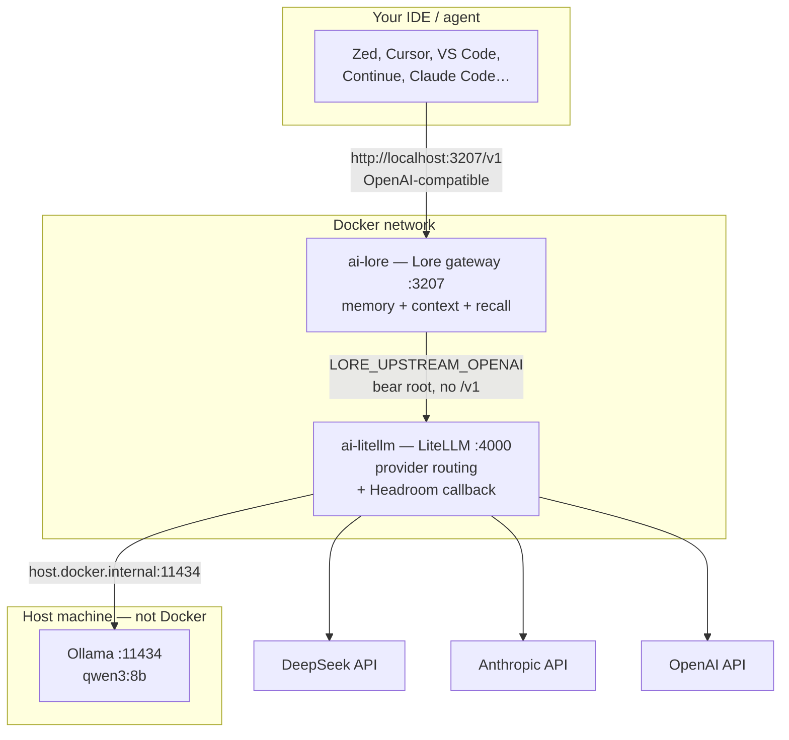
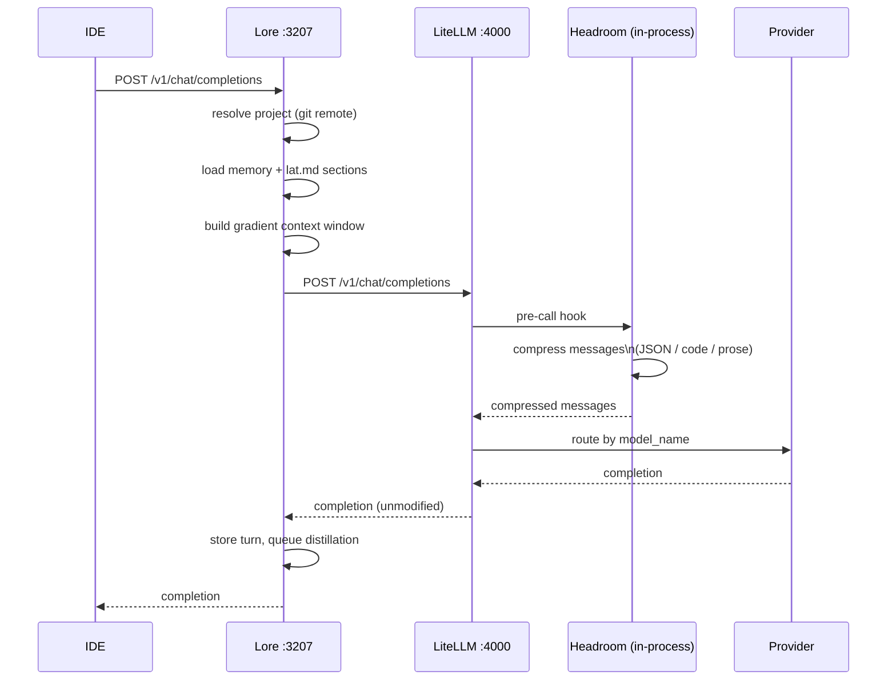
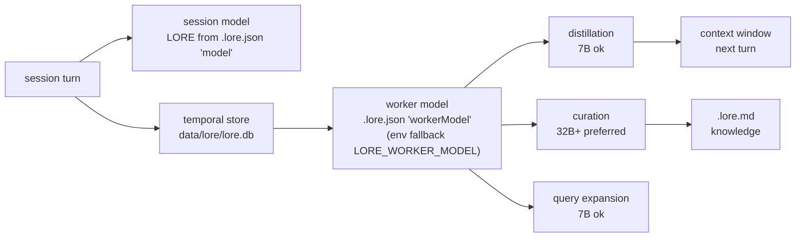
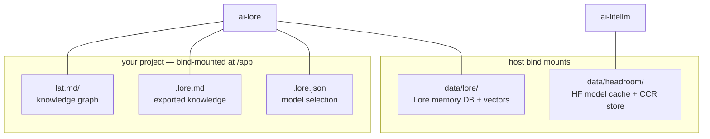

# perfect-ai-stack

**AI proxy stack**
LiteLLM (with Headroom compression sidecar)

- Lore in Docker,
- per-repo lat.md knowledge graph scaffolded git-hook enforcement.

```
// e.g using Zed IDE
Zed -> Lore (:3207) -> LiteLLM + Headroom (:4000) -> DeepSeek / Anthropic / OpenAI / Ollama (host)
```

## Install

One command, from your project:

```sh
cd ~/code/your-project
npx perfect-ai-stack init
```

`init` starts the gateway, scaffolds `lat.md/` + the pre-commit hook, and
prints the IDE config to use. Safe to re-run;
if the gateway is already up it, skips startup instead of restarting it.
Requires Docker Desktop (see [Prerequisites](#prerequisites)).

`npx` installs the package into npm's cache and runs `bin/ai-stack.sh` from
there.
Project files (`.env`, `lat.md/`, git hooks) always land in the project
you run it from.

Keep the memory DB and Headroom cache out of the npx cache dir, so they survive upgrades:

```sh
export AI_STACK_DATA_DIR=~/.ai-stack      # Lore DB + Headroom cache (shared across projects)
```

Working on the stack itself? Clone it and see
[Development](#development) — `sh bin/ai-stack.sh init` behaves identically.

## Prerequisites

**Docker Desktop, installed and running.**
That's the only requirement — no API keys needed to try it (local models run through Ollama).

```sh
open -a Docker      # macOS; wait for the whale icon to stop animating
```

`init` checks this and tells you exactly what's missing if it isn't there.

## Quick start

From any existing project:

```sh
npx perfect-ai-stack init
```

Then point your IDE at the gateway:

```
Base URL:  http://localhost:3207/v1
API key:   any non-empty string (auth is off on this local stack)
Model:     [ollama model](https://withlore.ai/docs/guides/local-inference/#ollama) (free, local via Ollama)
           deepseek-v4-flash   (needs OPENAI_API_KEY)
```

No IDE config to write: the same endpoint works for Zed, Cursor, VS Code
(Continue/Copilot), and anything else that takes a custom base URL.

**Already use a tool with built-in memory or context compression?**
Read [Choosing what to use](#choosing-what-to-use) before pointing it here — for
Claude Code and Copilot you likely want only part of this stack.

> **Ran Lore on the host before?** Clear the stale env vars first — they
> override the compose defaults and point inside the container at nothing.
>
> ```sh
> unset LORE_UPSTREAM_OPENAI LORE_UPSTREAM_ANTHROPIC LORE_WORKER_UPSTREAM LORE_WORKER_MODEL LORE_WORKER_API_KEY
> ```

First start pulls the LiteLLM base image and builds both containers — allow a
few minutes. The first model request also downloads Headroom's compression
model (~275 MB) once, cached in `data/headroom/`.

## Choosing what to use

Some clients already ship memory and context compression. Pointing this stack
at them can duplicate work or fight the built-in behaviour, so pick per tool:

| Your client                              | Already has                                            | Use from this stack     | Why                                                                                                             |
| ---------------------------------------- | ------------------------------------------------------ | ----------------------- | --------------------------------------------------------------------------------------------------------------- |
| **Claude Code**                          | Auto-compaction, `CLAUDE.md` memory                    | ✅ `lat.md` + hook only | Skip Lore — it's also an Anthropic-protocol proxy and its distillation overlaps compaction                      |
| **GitHub Copilot** (VS Code / JetBrains) | Repo-aware indexing; **BYOK base URL is very limited** | ⚠️ `lat.md` + hook only | Copilot generally can't take a custom `OPENAI_BASE_URL`; point Continue at the gateway instead if you want Lore |
| **Cursor**                               | Built-in codebase index + rules                        | ✅ Full stack           | Its index is code-retrieval, not decision/error memory — no overlap with Lore                                   |
| **Zed**                                  | Nothing built-in                                       | ✅ Full stack           | The reference client                                                                                            |
| **Continue / Cline / Aider**             | Nothing built-in                                       | ✅ Full stack           | Plain BYOK OpenAI clients                                                                                       |
| **OpenCode / Pi**                        | Nothing built-in                                       | ✅ Full stack           | `lore run` auto-configures these natively                                                                       |

Rule of thumb: **`lat.md` never conflicts** — it's a plain markdown knowledge
graph, and Lore indexes it automatically when present. The parts worth being
selective about are **Lore** (memory) and **Headroom** (token compression),
both of which overlap what Claude Code and Copilot already do natively.

### Add only the knowledge graph (no Docker)

If you want the `lat.md` workflow without the gateway:

```sh
npm i -g lat.md
cd your-project && lat init          # creates lat.md/, wires agents
lat check                            # also runs on commit once init adds the hook
```

### Use the gateway with a tool that has its own memory

Point the tool at `http://localhost:3207/v1` as usual, then disable the
overlapping halves in `.lore.json` at your project root:

```json
{
  // Keep context management + recall, drop the long-term knowledge base
  "knowledge": { "enabled": false }
}
```

Set `"knowledge": { "enabled": false }` when your tool manages its own
persistent facts; Lore then still handles distillation, recall, and the
context window, without maintaining a second set of facts. See Lore's own
configuration docs for the full schema.

## Commands

| Command                              | What it does                                                            |
| ------------------------------------ | ----------------------------------------------------------------------- |
| `npx perfect-ai-stack <cmd>`         | Same as `sh bin/ai-stack.sh <cmd>` — run from any project               |
| `sh bin/ai-stack.sh init`            | **Start here.** Start gateway + scaffold this project + show IDE config |
| `sh bin/ai-stack.sh wizard`          | Interactive setup for env vars (only for cloud models)                  |
| `sh bin/ai-stack.sh start`           | Start the gateway only; also scaffolds lat.md + hook                    |
| `sh bin/ai-stack.sh stop`            | Stop the gateway                                                        |
| `sh bin/ai-stack.sh logs`            | Follow logs (all services)                                              |
| `sh bin/ai-stack.sh ps`              | Show status                                                             |
| `sh bin/ai-stack.sh update`          | Rebuild LiteLLM (with Headroom) + Lore from latest base images          |
| `sh bin/ai-stack.sh setup-lat [dir]` | Scaffold lat.md + hook in `[dir]` (default: cwd); runs on `start` too   |

## Model selection

You choose which models your session and Lore's background workers use.
Selection is **per project**, stored in `.lore.json` at your project root, so
switching models needs no restart and doesn't affect other projects.

```sh
npx perfect-ai-stack models                              # list + pick interactively
npx perfect-ai-stack models deepseek-v4-flash qwen3:8b  # session, worker can be either qwen2.5:3b-instruct/qwen2.5:1.5b-instruct/qwen3:8b - non-thinking by default
```

That writes `.lore.json`:

```json
{
  "model": { "providerID": "openai", "modelID": "deepseek-v4-flash" },
  "workerModel": { "providerID": "openai", "modelID": "qwen3:8b" }
}
```

- **session** — the model your IDE chat uses.
- **worker** — distillation, curation, query expansion (background, async).
- Omitting `workerModel` falls back to the session model, then to
  `LORE_WORKER_MODEL` (env default `openai/qwen3:8b`).
- Existing keys in `.lore.json` (e.g. `knowledge`) are preserved.
- Both `providerID`s are `openai` because every model here is reached through
  LiteLLM over the OpenAI protocol. **Don't split providers** — cross-provider
  worker calls fail (wrong credentials, wrong API format).

### Make the worker a local model

The worker runs on **every session**, in the background, whether or not you
actually chat — distillation after each segment, curation on idle, query
expansion per recall. Point it at a cloud model and you pay on every session.
Point it at Ollama and that cost is zero.

```sh
ollama pull qwen3:8b                                # 7B: fine for distillation
npx perfect-ai-stack models deepseek-v4-flash qwen3:8b
```

This is the recommended shape: **frontier model for the session, local model
for the worker**. It works because both route through LiteLLM on the same
protocol — see [All models route through LiteLLM](#all-models-route-through-litellm).

**Local quality floors** ([Lore's local-inference guide](https://withlore.ai/docs/guides/local-inference/)):

| Pipeline            | Local model        | Notes                                                                      |
| ------------------- | ------------------ | -------------------------------------------------------------------------- |
| **Distillation**    | 7B-class, Q4/Q5    | Fine. Produces usable observation logs, even code-heavy                    |
| **Query expansion** | 7B-class           | Fine — it only rephrases recall queries                                    |
| **Curation**        | **32B+ preferred** | 7B yields duplicates, wrong categories, low-confidence facts in `.lore.md` |

If your local model is too small for curation, **turn curation off** rather
than accept bad `.lore.md` entries — everything else keeps working:

```json
{ "curator": { "enabled": false } }
```

That's the honest tradeoff for a small local worker: you keep distillation,
recall, context management, and `lat.md` indexing, and lose automatic
long-term knowledge extraction.

**Watch the memory cost.** A 32B model needs real RAM; if you only have a
laptop, a 7B worker with `curator.enabled=false` is the sane choice.

**To use a model not listed above**, add it to `config/litellm.yaml` under
`model_list`, then restart the gateway once (`ai-stack restart`). Example:

```yaml
- model_name: qwen2.5-coder:14b
  litellm_params:
    model: ollama/qwen2.5-coder:14b
    api_base: http://host.docker.internal:11434
```

Then `ai-stack models deepseek-v4-flash qwen2.5-coder:14b`. Any model your IDE
list shows comes from this file — `curl -s http://localhost:3207/v1/models`.
Ready-made local block for `qwen2.5-coder:14b` is already commented into
`config/litellm.yaml`; uncomment it after pulling the model.

### Don't point Lore directly at Ollama

Lore's [local-inference guide](https://withlore.ai/docs/guides/local-inference/)
shows `LORE_UPSTREAM_OLLAMA=http://localhost:11434` for talking to a local
server without a proxy. **That env var does not exist in the gateway version
pinned here** (`@loreai/gateway` 0.40.0 reads only `LORE_UPSTREAM_OPENAI` and
`LORE_UPSTREAM_ANTHROPIC`), so setting it is a silent no-op.

Even on a newer gateway, prefer routing through LiteLLM: `LORE_UPSTREAM_*` is
where Lore forwards the session, so bypassing LiteLLM also bypasses
**Headroom compression**, and you'd lose the provider routing that
`config/litellm.yaml` centralises. Local models here are local _because
LiteLLM's `api_base` points at your Ollama host_ — not because Lore knows
Ollama exists.

## One stack, many projects

The stack is cloned **once** — every project you work in uses the same
running gateway (Lore keys memory per project via its git remote, not per
clone), and `lat` is a single global npm install. Per-project setup is just
the lat.md scaffold + pre-commit hook:

```sh
cd ~/code/project-a
sh /path/to/perfect-ai-stack/bin/ai-stack.sh setup-lat
# or from anywhere: sh .../ai-stack.sh setup-lat ~/code/project-b
```

Run it once per project — nothing to clone or reinstall. `start`/`stop`/
`logs`/`update` stay in the stack clone; point each project's IDE at the
shared gateway (see “IDE / agent setup”).

## Environment Variables

All vars have sensible defaults — API keys are only needed if you use cloud models.
Docker Compose interpolates `${VAR}` only inside `docker-compose.yml`, not
within `.env` values — overrides must be literal values (no `$REF`
indirection; see `.env.example.md`).

### Where to put API keys

Either export them in your shell profile (`~/.zshrc`, `~/.bashrc`):

```sh
export OPENAI_API_KEY="sk-..."
export ANTHROPIC_API_KEY="sk-ant-..."
```

or write them to a repo-local `.env` file (auto-loaded by Docker Compose,
gitignored). A template with every supported variable (zero secrets) is
committed as [`.env.example.md`](.env.example.md) — copy it to `.env` and
adjust. The wizard (`ai-stack.sh wizard`) can generate this for you too:

```sh
OPENAI_API_KEY=sk-...
ANTHROPIC_API_KEY=sk-ant-...
```

Don't override the `LORE_*` variables unless you need to — the defaults
(shown in `.env.example.md`) point Lore at LiteLLM, and that's where you
want it (see the stale-env warning in Quick start).

### LiteLLM

| Variable            | Purpose           | Default              |
| ------------------- | ----------------- | -------------------- |
| `ANTHROPIC_API_KEY` | Claude 3.5 Sonnet | only if using Claude |
| `OPENAI_API_KEY`    | DeepSeek / GPT-4o | only if using cloud  |

No `LITELLM_MASTER_KEY` is set: LiteLLM runs **auth-disabled** (accepts any
key) so Lore's forwarded client keys work without a key database. This is a
local single-user stack; don't expose port `4000` beyond your machine.

### Lore (Docker)

| Variable                  | Purpose                         | Default                         |
| ------------------------- | ------------------------------- | ------------------------------- |
| `LORE_UPSTREAM_OPENAI`    | OpenAI-compatible upstream      | `http://litellm:4000`           |
| `LORE_UPSTREAM_ANTHROPIC` | Anthropic upstream              | `http://litellm:4000`           |
| `LORE_WORKER_UPSTREAM`    | Upstream for background workers | `http://litellm:4000`           |
| `LORE_WORKER_MODEL`       | Background worker model         | `openai/qwen3:8b`            |
| `LORE_WORKER_API_KEY`     | Key used for worker calls       | `sk-litellm-master` (any works) |
| `LORE_DEBUG`              | Enable debug logging            | `true`                          |

`LORE_WORKER_MODEL` is a `provider/model` pair. The part after the slash is the
model name sent to `LORE_WORKER_UPSTREAM` and **must exist in LiteLLM's
`model_list`** (`config/litellm.yaml`). The part before the slash is the
**provider ID**, which selects the protocol the worker speaks:

- `openai/…` — OpenAI-compatible chat completions (LiteLLM, DeepSeek, Ollama).
- `anthropic/…` — Anthropic Messages API.

Lore resolves `providerID` and derives the protocol from it — it does not parse
a prefix string, and there is no implicit `anthropic` fallback for a bare model
name. Always write the `openai` provider when the worker targets LiteLLM, or the
worker speaks a protocol LiteLLM's `/v1/chat/completions` route won't answer.

**Workers must use the same provider as the session** — cross-provider worker
calls fail (wrong credentials, wrong API format). They _may_ use a different
model and a different real backend: `deepseek-v4-flash` (DeepSeek) for the
session and `qwen3:8b` (Ollama) for the worker is fine, because both are
`openai` provider and both route through LiteLLM. Override the URL the worker
calls with `LORE_WORKER_UPSTREAM`.

Change both the provider and the model name if your Ollama uses a different tag
(e.g. `openai/qwen2.5:7b` + a matching `model_list` entry).

The upstream defaults point at LiteLLM inside the Docker network — override
them only if you want Lore to skip LiteLLM.

### Ollama-only (no API keys)

Requires Ollama running on the host (`docker-compose` reaches it at
`host.docker.internal:11434`) with the models you use pulled (`llama3` and
`qwen3:8b`):

```sh
brew install ollama && ollama serve
ollama pull llama3
ollama pull qwen3:8b
```

Then:

```sh
sh bin/ai-stack.sh start
```

No keys needed — `qwen3:8b` routes through LiteLLM to Ollama on the host.

## Models

| Model name          | Backend       |
| ------------------- | ------------- |
| `deepseek-v4-flash` | DeepSeek API  |
| `deepseek-v4-pro`   | DeepSeek API  |
| `qwen3:8b`       | Ollama (host) |

## Architecture

### Request flow

One box means one network hop. Everything above the "Docker network" line runs
in a container; Ollama runs **on the host**, which is why LiteLLM reaches it at
`host.docker.internal` rather than a service name.



Lore is the OpenAI-compatible `/v1` endpoint your IDE talks to. It is the only
port you point a client at; `:4000` is LiteLLM's own API and is not part of the
user-facing path.

### What happens on one request



Two things worth noting in that flow: Headroom compresses the **request only**
(responses pass through untouched), and the memory write happens on the way
back so a slow distillation never blocks your reply.

### Session vs worker

This is the part that most affects cost. The **worker** runs three background
pipelines — distillation, curation, query expansion — on every session,
whether or not you chat.



Both models must be the **same provider** (here: `openai` via LiteLLM) —
cross-provider worker calls fail. Point the worker at a local model to keep
this at zero cost; see [Make the worker a local model](#make-the-worker-a-local-model).

### Where state lives

Everything stateful is on the host, so it survives `stop`, `update`, and
`docker compose down`.



The container itself is disposable: `lat.md/`, `.lore.md`, and `.lore.json`
are meant to be committed, while `data/` holds the machine-local DB and is
gitignored.

## IDE / agent setup (BYOK)

The stack is client-agnostic: any editor or coding agent that supports
bring-your-own-key (BYOK) OpenAI-compatible endpoints can use it. Point your
client at Lore's gateway — any API key value works, since LiteLLM runs
auth-disabled and the key is just passed through:

```sh
export OPENAI_BASE_URL=http://localhost:3207/v1      # OpenAI-compatible clients
# or
# export ANTHROPIC_BASE_URL=http://localhost:3207     # Anthropic-protocol clients
```

Use a model name from the Models table above (e.g. `deepseek-v4-flash` for
DeepSeek, or `qwen3:8b` for Ollama). Zed, Cursor, VS Code
Copilot, Claude Code — anything that accepts a custom base URL — works the
same way. These are guidelines, not repo-committed IDE config: adapt to
whatever editor your team uses.

### Knowledge graph access (MCP)

If your IDE supports MCP, register lat's server so the agent queries the graph
with `lat search` / `lat section` instead of grepping. Example — Zed
(`.zed/mcp.json` in the project):

```json
{
  "servers": {
    "lat": { "command": "lat", "args": ["mcp"] }
  }
}
```

Claude Code, Cursor, and friends get hooks + MCP automatically from
`lat init`. For other IDEs, adapt the pattern: `lat mcp` speaks stdio MCP.

Lore's own gateway also prints these instructions on startup
(`docker compose logs lore`).

## lat.md

[`lat.md`](https://www.npmjs.com/package/lat.md) is a markdown knowledge
graph for the codebase — high-level concepts, business logic, and architecture
that your agent reads via `lat search` / `lat section` (or its MCP server).
`ai-stack start` scaffolds it if missing or still just the committed
placeholder intro file; re-run with `sh bin/ai-stack.sh setup-lat`.

```sh
lat search "payment flow"   # semantic search across lat.md sections
lat section "architecture"  # show a section with its links and refs
lat gen agents.md           # generate agent instructions that use lat
lat check                   # validate links + code references (runs on every commit)
lat reindex                 # rebuild the embedding index (lat.md/.cache/, gitignored)
```

`lat init` (which the setup runs) is interactive — it asks which coding agents
you use and wires up hooks/MCP/skills for them. It therefore only runs when
stdin is a terminal; an unattended `start` prints a hint to run
`ai-stack setup-lat` manually instead. Semantic search works offline out of
the box (bundled local embedding model) — no key needed.

**Enforcement:** `setup-lat` installs a git pre-commit hook (`.git/hooks/
pre-commit`) that runs `lat check`. A commit that changes a `// @lat:` anchor
without updating the graph fails — docs can't drift silently, for human edits
as well as agent edits. The install is idempotent: an existing hook that
already runs `lat check` is left alone, and one without it gets `lat check`
appended.

The knowledge base itself (`lat.md/lat.md`) is meant to be committed; only the
generated embedding index (`lat.md/.cache/`) is gitignored.

## Headroom

Headroom runs **inside the LiteLLM container** as a callback — no separate
service. The custom image (`litellm/Dockerfile`) installs `headroom-ai`, and
`litellm/entrypoint.py` registers `HeadroomCallback` as a LiteLLM callback
_before_ the proxy starts. (YAML dotted-path callbacks aren't used: LiteLLM
registers those as the class, not an instance, which silently breaks the async
pre-call hook.)

Before each request is forwarded to a provider, the callback compresses the
messages in-process (JSON tool outputs via SmartCrusher, code via tree-sitter,
prose via the Kompress-v2-base model). Responses pass through unchanged. This
applies to **both** Lore's session model and its background worker model — all
Lore traffic is routed through LiteLLM (see below).

- Local-first: nothing is sent to a Headroom cloud; compression runs on your
  machine in the LiteLLM container.
- User messages are left untouched by default, and code in the last 4
  messages is protected from compression (coding-agent defaults).
- **First compression downloads the model** (`chopratejas/kompress-v2-base` from
  HuggingFace, ~a few hundred MB) and can take a minute. It is cached in
  `data/headroom/` so later starts don't re-download it. On x86 hosts without
  AVX2 (some Docker/QEMU setups), Headroom falls back to non-ONNX compressors
  automatically.
- In callback mode compression is one-way (originals are not retrievable — CCR
  retrieval is a proxy-mode feature), but the CCR originals store still lives on
  the host (`data/headroom/ccr_store.db`), so a container recreate doesn't wipe
  it mid-session.

## Persistence

Everything stateful lives in `data/` on the host — outside the containers, so
it survives `stop`, `update`, and `docker compose down`:

| Dir              | What it holds                                   |
| ---------------- | ----------------------------------------------- |
| `data/lore/`     | Lore memory (SQLite DB + vector embeddings)     |
| `data/headroom/` | Headroom's HF model cache + CCR originals store |

```sh
sqlite3 data/lore/lore.db "SELECT * FROM projects;"
```

`.lore.md` exports land in this repo's root (the container's working directory).
Already have a Lore DB from a previous host install at `~/.local/share/lore`?
Copy it over once before the first start:

```sh
mkdir -p data/lore && cp -R ~/.local/share/lore/. data/lore/
```

### All models route through LiteLLM

Lore's gateway hardcodes a model-prefix → provider table (`claude-*` →
`api.anthropic.com`, `gpt-*`/`deepseek-*` → OpenAI, …) that would bypass
LiteLLM. The Lore Dockerfile (`Dockerfile`) patches that table out, so **every**
session request falls through to `LORE_UPSTREAM_*` (LiteLLM) and gets Headroom
compression. LiteLLM then maps the model name to the real provider via
`config/litellm.yaml`.

The **worker** takes a separate path: `LORE_WORKER_MODEL` splits on `/` into
`provider/model`, and the provider ID selects the protocol. Write the `openai`
provider explicitly. The default `openai/qwen3:8b` speaks the OpenAI
protocol, so the worker sends plain `qwen3:8b` to LiteLLM (→ Ollama), exactly
like the session model sends `deepseek-v4-flash` (→ DeepSeek). Session and worker
can therefore use different real backends (DeepSeek + Ollama) as long as both use
the `openai` provider through LiteLLM — that same-provider constraint is why a
cross-provider worker pairing fails with wrong credentials / wrong API format.

Check it works:

```sh
docker compose logs litellm | grep Headroom   # per-request "Headroom: N->M tokens" lines
```
