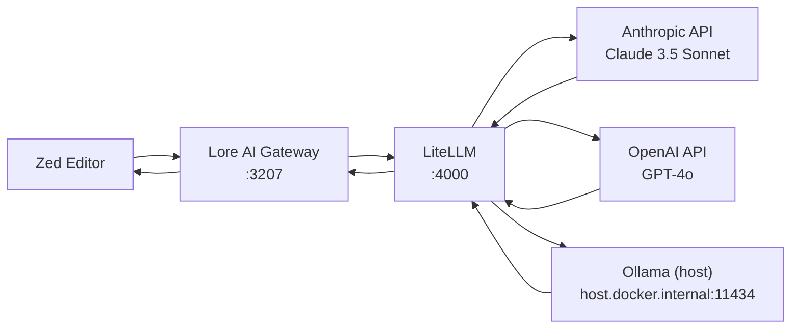

# perfect-ai-stack

**Docker-based AI proxy stack** — one command to run Lore AI Gateway + LiteLLM with Headroom guardrails.

```
Zed → Lore (:3207) → LiteLLM (:4000) → Anthropic / OpenAI / Ollama (host)
```

## Prerequisites

- Docker + Docker Compose (v2)
- API keys in environment (see below)

## Quick start

```sh
# Clone once
git clone git@github.com:tulitheprogrammer/perfect-ai-stack.git
cd perfect-ai-stack

# Set API keys
export ANTHROPIC_API_KEY=sk-ant-...
export OPENAI_API_KEY=sk-...

# Start the stack
bin/ai-stack start
```

Or install globally:

```sh
npm install -g github:tulitheprogrammer/perfect-ai-stack
ai-stack start
```

## Commands

| Command                | What it does                          |
|------------------------|---------------------------------------|
| `ai-stack start`       | Start all containers (detached)       |
| `ai-stack stop`        | Stop all containers                   |
| `ai-stack logs`        | Follow combined logs                   |
| `ai-stack ps`          | Show container status                  |
| `ai-stack update`      | Pull latest images and recreate       |
| `ai-stack setup-lat`   | Scaffold lat.md in current project    |

## Architecture



## Configuration

| Variable             | Purpose                        | Default              |
|----------------------|--------------------------------|----------------------|
| `ANTHROPIC_API_KEY`  | Claude 3.5 Sonnet via LiteLLM  | required             |
| `OPENAI_API_KEY`     | GPT-4o via LiteLLM             | required             |
| `LITELLM_MASTER_KEY` | LiteLLM admin key              | `sk-litellm-master`  |
| `LORE_LLM_KEY`       | Key Lore uses (falls back to OPENAI_API_KEY) | from OPENAI_API_KEY |

## Models

| Model name         | Backend         | Config                                      |
|--------------------|-----------------|---------------------------------------------|
| `claude-3-5-sonnet`| Anthropic API   | `config/litellm.yaml`                       |
| `gpt-4o`           | OpenAI API      | `config/litellm.yaml`                       |
| `local-llama`      | Ollama (host)   | `http://host.docker.internal:11434`          |

## lat.md Scaffold

```sh
cd your-project
ai-stack setup-lat
```

## Legacy

The old shell-based approach (Lore + Headroom + LiteLLm as local CLIs) is archived in [`legacy/`](legacy/).
