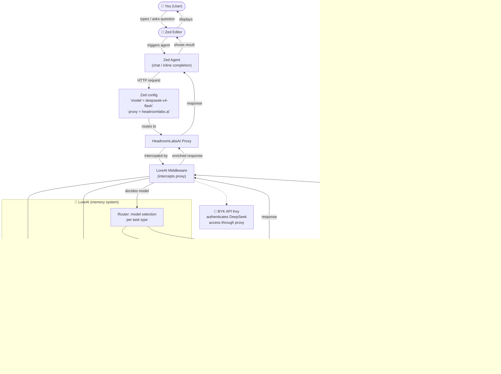

```mermaid
flowchart TD
    %% Actors
    USER(["👤 You (User)"])
    ZED(["📝 Zed Editor"])

    %% Zed side
    ZED_AGENT["Zed Agent\n(chat / inline completion)"]
    ZED_CONFIG["Zed config\n`model = deepseek-v4-flash`\n`proxy = headroomlabs.ai`"]

    %% Proxy / Middleware
    PROXY["HeadroomLabsAI Proxy"]
    LORE_MW["LoreAI Middleware\n(intercepts proxy)"]

    %% Lore internals
    subgraph LORE ["🧠 LoreAI (memory system)"]
        direction LR
        LORE_STORE["Long-term Knowledge\n(lore store / .lore.md)"]
        LORE_CTX["Context Compression\n(distillation, recall)"]
        LORE_ROUTER["Router: model selection\nper task type"]
    end

    %% Models
    DEEPSEEK["DeepSeek V4 Flash\n(primary model)\n💰 BYK API Key"]
    ORNITH["Ornith (local, Ollama)\n(worker model)\n💻 runs on-device"]

    %% Workers
    subgraph WORKERS ["🛠️ Worker Tasks (Ornith)"]
        INSIGHTS["Insights extraction\n(summarize sessions)"]
        RECALL["Recall indexing\n(build search indices)"]
        COMPRESS["Context distillation\n(compress old turns)"]
    end

    %% Flows
    USER -->|types / asks question| ZED
    ZED -->|triggers agent| ZED_AGENT
    ZED_AGENT -->|HTTP request| ZED_CONFIG
    ZED_CONFIG -->|routes to| PROXY

    PROXY -->|intercepted by| LORE_MW

    LORE_MW -->|augments context| LORE_STORE
    LORE_MW -->|reads/writes recall| LORE_CTX
    LORE_MW -->|decides model| LORE_ROUTER

    LORE_ROUTER -->|primary chat / code tasks| DEEPSEEK
    LORE_ROUTER -->|background insight workers| ORNITH

    ORNITH -->|runs| INSIGHTS
    ORNITH -->|runs| RECALL
    ORNITH -->|runs| COMPRESS

    INSIGHTS -->|feeds structured memory| LORE_STORE
    RECALL -->|enables search| LORE_CTX
    COMPRESS -->|keeps context under limit| LORE_MW

    DEEPSEEK -->|response| LORE_MW
    LORE_MW -->|enriched response| PROXY
    PROXY -->|response| ZED_AGENT
    ZED_AGENT -->|shows result| ZED
    ZED -->|displays| USER

    %% Key annotations
    LINK_ANNOT["🔗 BYK API Key\nauthenticates DeepSeek\naccess through proxy"]
    LORE_ANNOT["🧠 LoreAI intercepts\nat proxy level, not at\nmodel level — it wraps\nthe whole request/response"]

    LORE_MW -.-> LINK_ANNOT
    DEEPSEEK -.-> LORE_ANNOT
```
