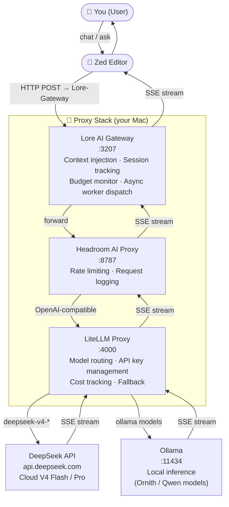
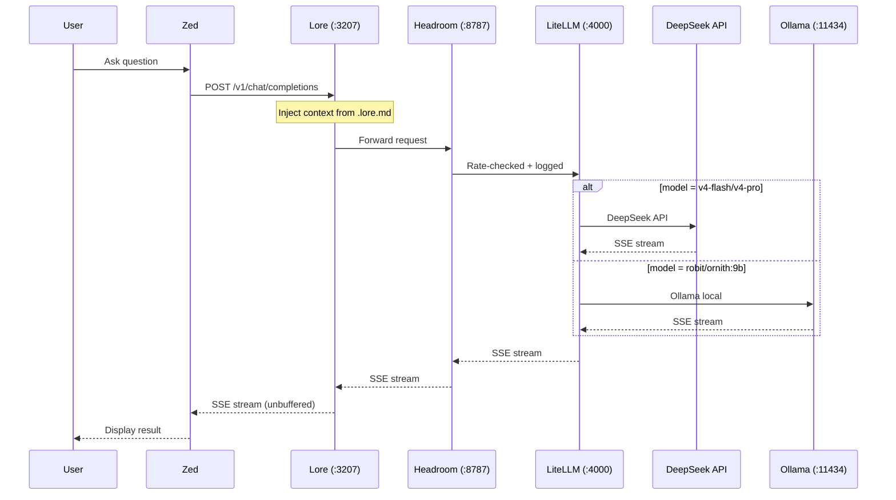
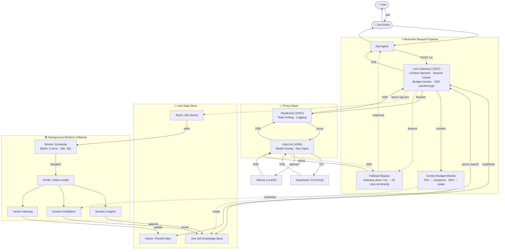

# AI Proxy Stack — macOS Setup Guide

Set up the three-proxy stack that sits between **Zed Editor** and your AI models (DeepSeek cloud + Ollama local). Designed for a team onboarding onto the same architecture.

---

## Architecture Overview



### Request flow (end to end)

1. **Zed** sends a prompt to **Lore** (`localhost:3207`)
2. **Lore** injects context from `.lore.md`, then forwards to **Headroom** (`localhost:8787`)
3. **Headroom** applies rate limits / logging, forwards to **LiteLLM** (`localhost:4000`)
4. **LiteLLM** routes to the right model:
   - `v4-flash` / `v4-pro` → DeepSeek API (cloud)
   - `robit/ornith:9b` → Ollama (local)
5. The response **streams back** through the same chain — SSE passthrough, no buffering



### Fallback behavior

If Lore is down or unresponsive (>2s timeout), Zed bypasses Lore and calls **LiteLLM directly** — cold response beats no response.

---

## Prerequisites

| Tool         | Version            | Why                     |
| ------------ | ------------------ | ----------------------- |
| macOS        | 14+ (Sonoma)       | `lsof`, `pf` built-in   |
| Homebrew     | Latest             | Package installation    |
| Python 3.11+ | System or Homebrew | LiteLLM runs on Python  |
| Node.js 18+  | —                  | Zed, Lore CLI (via npm) |
| Ollama       | Latest             | Local worker models     |

---

## Step 1 — Environment Variables

This is the **only** environment variable you need to set. The proxies themselves require no auth between each other.

```bash
OPENAI_API_KEY="sk-your-deepseek-key-here"
OLLAMA_MODEL=llama3.1:8b
HEADROOM_URL="http://localhost:8787/v1"

export DUMMY_API_KEY="sk-dummy-key"
export OPENAI_API_KEY

export LORE_UPSTREAM_OPENAI=$HEADROOM_URL
export LORE_WORKER_UPSTREAM=$HEADROOM_URL
export LORE_UPSTREAM_ANTHROPIC=$HEADROOM_URL

export LORE_WORKER_MODEL=$OLLAMA_MODEL
export LORE_WORKER_API_KEY=$DUMMY_API_KEY

```

Add it to `~/.zshenv` (or `.zshrc`) so it's available in every terminal session. Never commit it to git.

---

## Step 2 — Install Each Proxy

### 2a. LiteLLM (port 4000)

The model router. Maps model names (`v4-flash`, `robit/ornith:9b`) to real API endpoints.

```bash
pip install 'litellm[proxy]'
```

Verify:

```bash
litellm --version
```

### 2b. Headroom AI (port 8787)

Rate limiter & request logger. An optional but recommended layer.

```bash
npm install -g @headroom-ai/proxy
```

Verify:

```bash
headroom --version
```

> If unavailable, you can run without Headroom by pointing Lore directly at LiteLLM. See [optional: skip Headroom](#optional-skip-headroom).

### 2c. Lore AI Gateway (port 3207)

Context/memory layer. Injects `.lore.md` knowledge into every request, manages sessions, and dispatches background workers.

```bash
npm install -g @byk/lore
```

Verify:

```bash
lore --version
```

### 2d. Ollama (for local worker models)

Required for background tasks (context distillation, insight extraction, vector indexing).

```bash
brew install ollama
ollama pull llama3.1:8b        # ~4.7 GB RAM — current worker model
# or for lighter weight (<16 GB system RAM):
ollama pull qwen2.5-coder:7b  # ~4.0 GB RAM
# or for heavier local inference (>16 GB RAM):
ollama pull robit/ornith:9b   # ~5.1 GB RAM
```

---

## Step 3 — Configuration Files

### 3a. LiteLLM config — `.litellm_config.yaml`

Place this in your project root:

```yaml
model_list:
  # Session Model -> DeepSeek API
  - model_name: v4-flash
    litellm_params:
      model: deepseek/deepseek-v4-flash
      api_base: "https://api.deepseek.com"
      api_key: "os.environ/OPENAI_API_KEY"
  - model_name: v4-pro
    litellm_params:
      model: deepseek/deepseek-v4-pro
      api_base: "https://api.deepseek.com"
      api_key: "os.environ/OPENAI_API_KEY"
  # Worker Model -> Local Ollama
  - model_name: llama3.1:8b
    litellm_params:
      model: ollama/llama3.1:8b
      api_base: "http://localhost:11434"
      num_ctx: 16384
    model_info:
      supports_function_calling: false
```

### 3b. Lore config — `.lore.json`

Place this in your project root:

```json
{
  "debug": true,
  "distillation": {
    "toolOutputMaxChars": 0
  },
  "gateway": {
    "port": 3207
  },
  "model": {
    "providerID": "openai",
    "modelID": "v4-flash"
  },
  "workerModel": {
    "providerID": "openai",
    "modelID": "llama3.1:8b"
  }
}
```

### 3c. Lore knowledge base — `.lore.md`

This file stores persistent context (gotchas, decisions, architecture). Lore reads it on every request and appends to it after sessions. Start with a header:

```markdown
<!-- Managed by lore — manual edits are imported on next session. -->

## Long-term Knowledge
```

---

## Step 4 — Zed Editor Configuration

Add this to `~/.config/zed/settings.json`:

```json
{
  "language_models": {
    "openai_compatible": {
      "Lore-Gateway": {
        "api_url": "http://127.0.0.1:3207/v1",
        "available_models": [
          {
            "name": "v4-flash",
            "display_name": "DeepSeek V4 Flash (via Lore)",
            "max_tokens": 6400,
            "max_output_tokens": 8192,
            "capabilities": {
              "tools": true,
              "chat_completions": true,
              "parallel_tool_calls": false
            }
          },
          {
            "name": "v4-pro",
            "display_name": "DeepSeek V4 Pro (via Lore)",
            "max_tokens": 64000,
            "capabilities": {
              "tools": true,
              "chat_completions": true
            }
          }
        ]
      }
    }
  },
  "agent": {
    "default_model": {
      "provider": "Lore-Gateway",
      "model": "v4-flash"
    }
  }
}
```

---

## Step 5 — Running the Stack

### Start all proxies

```bash
./scripts/proxy-stack.sh
```

What happens:

1. Kills stale processes on ports 3207, 4000, 8787 (if any)
2. Starts **LiteLLM** → `logs/litellm.log`
3. Starts **Headroom** (pointed at LiteLLM) → `logs/headroom.log`
4. Starts **Lore** (pointed at Headroom) → `logs/lore.log`
5. Reports ✓ or ⚠ for each service

### Monitor logs

```bash
./scripts/proxy-stack.sh logs
```

### Stop all

```bash
./scripts/proxy-stack.sh stop
```

Or hit **Ctrl+C** in the terminal where the stack is running.

---

## Step 6 — Verify the Chain

### 6a. Is LiteLLM routing?

```bash
curl -s http://localhost:4000/v1/models | jq .
```

You should see `v4-flash`, `v4-pro`, and `robit/ornith:9b` in the model list.

### 6b. Is the full chain working?

```bash
curl -s http://localhost:3207/v1/chat/completions \
  -H "Content-Type: application/json" \
  -d '{
    "model": "v4-flash",
    "messages": [{"role": "user", "content": "Say hello in one word."}],
    "stream": false
  }' | jq .
```

You should get a response back — it passed through Lore → Headroom → LiteLLM → DeepSeek.

---

## Dashboards

Each proxy exposes a web UI for monitoring and administration:

| Service      | URL                                                                | What You Can Do There                                                                                            |
| ------------ | ------------------------------------------------------------------ | ---------------------------------------------------------------------------------------------------------------- |
| **LiteLLM**  | [http://localhost:4000/ui](http://localhost:4000/ui)               | View model list, test prompts, monitor spend & token usage, manage keys, inspect request logs                    |
| **Headroom** | [http://127.0.0.1:8787/dashboard](http://127.0.0.1:8787/dashboard) | View request logs, rate limit stats, proxy health in the web dashboard. Also accessible via `logs/headroom.log`. |
| **Lore**     | [http://127.0.0.1:3207/ui](http://127.0.0.1:3207/ui)               | View session activity, context budget state, worker job queue, and memory index in the web UI.                   |
| **Ollama**   | [http://localhost:11434](http://localhost:11434)                   | API endpoint only — no dashboard. Use `ollama ps`, `ollama list` on the CLI.                                     |

> **Tip:** Open the [LiteLLM dashboard](http://localhost:4000/ui/) in your browser to verify models are registered. Don't use `/ui/model_hub_table/` — that page only shows models added via the UI database, not models defined in `.litellm_config.yaml`. The main `/ui/` dashboard shows everything from your config file.

## Zed Tasks

The project includes built-in Zed tasks so the team can start/stop the stack without remembering commands.

### How to run a task

- Open the command palette: **`Ctrl+Shift+P`** (macOS) / **`Cmd+Shift+P`** (macOS)
- Type **"tasks: run"** and select it
- Pick a task from the list

### Proxy stack tasks

| Task                                 | Shortcut | Action                                                                       |
| ------------------------------------ | -------- | ---------------------------------------------------------------------------- |
| `Start proxy stack (Lore + LiteLLM)` | —        | Runs `./scripts/proxy-stack.sh` — starts all three proxies in the background |
| `Stop proxy stack`                   | —        | Runs `./scripts/proxy-stack.sh stop` — kills all proxy processes             |

These are defined in `.zed/tasks.json` under the `// ── Proxy Stack ──` section:

```json
{
  "label": "Start proxy stack (Lore + LiteLLM)",
  "command": "./scripts/proxy-stack.sh",
  "cwd": "$ZED_WORKTREE_ROOT",
  "use_new_terminal": true,
  "allow_concurrent_runs": false,
},
{
  "label": "Stop proxy stack",
  "command": "./scripts/proxy-stack.sh stop",
  "cwd": "$ZED_WORKTREE_ROOT",
  "use_new_terminal": false,
  "allow_concurrent_runs": false,
}
```

> **Tip:** If you have the Zed tasks panel open, you can also click the play button next to each task.

### Other project tasks (for reference)

The `.zed/tasks.json` file also defines tasks for the broader project — building, testing, and running the app. These are unrelated to the proxy stack but available in the same picker:

| Task                                    | Command                                      |
| --------------------------------------- | -------------------------------------------- |
| `Run native app (PluginizerApp)`        | `swift run PluginizerApp`                    |
| `Build native app`                      | `swift build`                                |
| `Run CLI scanner (PluginScannerEngine)` | `swift run PluginScannerEngine`              |
| `Run Swift tests`                       | `swift test`                                 |
| `Build Rust lib (pluginizer-core)`      | `cargo build -p pluginizer-core`             |
| `Build all Rust (lib + tauri)`          | `cargo build`                                |
| `Tauri dev (desktop shell + webview)`   | `cargo tauri dev`                            |
| `Build Tauri app`                       | `cargo tauri build`                          |
| `Frontend dev server (Vite :5173)`      | `npm run dev`                                |
| `Install frontend deps`                 | `npm install && npm install @tauri-apps/api` |

---

## Optional: Skip Headroom

If you don't need rate limiting or logging, you can eliminate Headroom and point Lore directly at LiteLLM:

1. In `scripts/proxy-stack.sh`, change:

   ```bash
   LORE_UPSTREAM_OPENAI=http://localhost:8787/v1 lore start --local --bg
   ```

   to:

   ```bash
   LORE_UPSTREAM_OPENAI=http://localhost:4000/v1 lore start --local --bg
   ```

2. In `.lore.json`, remove or ignore the Headroom references.

The topology becomes: **Zed → Lore (:3207) → LiteLLM (:4000) → DeepSeek/Ollama**

---

## Troubleshooting

| Symptom                      | Likely Cause              | Fix                                                                                       |
| ---------------------------- | ------------------------- | ----------------------------------------------------------------------------------------- |
| `lore: command not found`    | Lore not installed        | `npm install -g @byk/lore`                                                                |
| `litellm: command not found` | LiteLLM not installed     | `pip install 'litellm[proxy]'`                                                            |
| Port already in use          | Stale process             | `./scripts/proxy-stack.sh stop` or `kill $(lsof -ti :PORT)`                               |
| DeepSeek returns 401         | Missing `OPENAI_API_KEY`  | Check `.env` is sourced                                                                   |
| LiteLLM can't start          | Port 4000 conflict        | Kill other services on :4000                                                              |
| Ollama model not found       | Model not pulled          | `ollama pull llama3.1:8b`                                                                 |
| Stack script hangs           | Port not releasing        | Wait a few seconds, retry                                                                 |
| Zed can't find model         | Provider name mismatch    | Check `"provider": "Lore-Gateway"` matches the key in `language_models.openai_compatible` |
| Slow first response          | Model cold start (Ollama) | Warm up: `ollama run llama3.1:8b ""`                                                      |

---

## Reference: Port Map

| Port  | Service           | Purpose                           | Dashboard                                            | Config key                  |
| ----- | ----------------- | --------------------------------- | ---------------------------------------------------- | --------------------------- |
| 3207  | Lore AI Gateway   | Context, memory, session mgmt     | — (CLI)                                              | Zed `api_url`, `lore` CLI   |
| 4000  | LiteLLM           | Model routing, key mgmt, fallback | [http://localhost:4000/ui](http://localhost:4000/ui) | Headroom `--openai-api-url` |
| 8787  | Headroom AI Proxy | Rate limiting, request logging    | — (CLI)                                              | Lore `LORE_UPSTREAM_OPENAI` |
| 11434 | Ollama            | Local inference                   | — (CLI)                                              | LiteLLM `api_base` in YAML  |

---

## Reference: Environment Variables

| Variable         | Required | Used By            | Description                                                      |
| ---------------- | -------- | ------------------ | ---------------------------------------------------------------- |
| `OPENAI_API_KEY` | ✅ Yes   | LiteLLM → DeepSeek | Upstream API key for DeepSeek — the only env var you need to set |

---

## Diagram: Full Architecture (with background workers)



---

## Quick Install Script

For a fresh macOS machine, run the following to install everything at once:

```bash
# 1. Install system deps
brew install ollama node python

# 2. Install proxies
npm install -g @byk/lore @headroom-ai/proxy
pip install 'litellm[proxy]'

# 3. Pull worker model
ollama pull llama3.1:8b

# 4. Set your API key
echo 'export OPENAI_API_KEY="sk-..."' >> ~/.zshenv
source ~/.zshenv

# 5. Start the stack
cd your-project
./scripts/proxy-stack.sh

# 6. Verify
curl http://localhost:3207/v1/models
```
